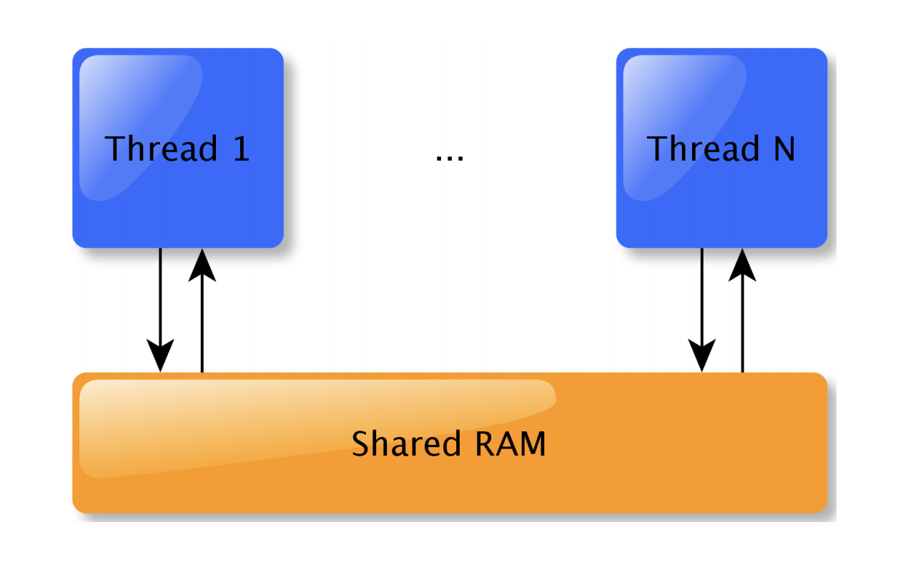

现代计算机体系结构上，CPU执行指令的速度远远大于CPU访问内存的速度，于是引入Cache机制来加速内存访问速度。
除了Cache以外，分支预测和指令预取也在很大程度上提升了CPU的执行速度。
随着SMP的出现，多线程编程模型被广泛应用，在多线程模型下对共享变量的访问变成了一个复杂的问题。
于是我们有必要了解一下内存模型，这是多处理器架构下并发编程里面的一个基础概念。

## 1. 什么是内存模型？

到底什么是内存模型呢？看到有两种不同的观点：

* A：内存模型是从来描述编程语言在支持多线程编程中对共享内存访问的策略[1]。
* B：内存模型的本质是指在单线程情况下CPU指令在多大程度上发生指令重排(reorder)[2]。

实际上A，B两种说法都是正确的，只不过是从不同的角度去说明memory order。



2011年发布的C11/C++11 ISO Standard为我们带来了memory order的支持，引用C++11里的一段描述：
```
The memory model means that C++ code now has a standardized library to call regardless of who made the compiler and on what platform it's running. There's a standard way to control how different threads talk to the processor's memory.[7]
```
C++11引入memory order的意义在于我们现在有了一个与运行平台无关和编译器无关的标准库，
让我们可以在high level languange层面实现对多处理器对共享内存的交互式控制。
我们的多线程终于可以跨平台啦！优秀~

一个良好的memory model定义包含3个方面：

* Atomic Operations
* Partial order of operations
* Visable effects of operations

C11/C++11使用atomic来描述memory model，

Note: You can't use volatile to safely exchange data between threads.
## 2. C11/C++11内存模型

C/C++11标准中提供了6种memory model:
```c++
enum memory_order {
    memory_order_relaxed,
    memory_order_consume,
    memory_order_acquire,
    memory_order_release,
    memory_order_acq_rel,
    memory_order_seq_cst
};
```

### 2.1 memory order releaxed
### 2.2 memory order consume
### 2.3 memory order acquire
### 2.4 memory order release
### 2.5 memory order acq_rel
### 2.6 memory order seq_cst


## 3. Java内存模型

## 4. Reference

* 1.[C++11 内存模型](https://wizardforcel.gitbooks.io/cpp-11-faq/26.html)
* 1.[高并发编程](https://zhuanlan.zhihu.com/p/48161056)
* 1.[Common Compiler Optimisations are Invalid](http://plv.mpi-sws.org/c11comp/popl15.pdf)
* 1.[CppCon 2015: Michael Wong “C++11/14/17 atomics and memory model..."](https://www.youtube.com/watch?v=DS2m7T6NKZQ)