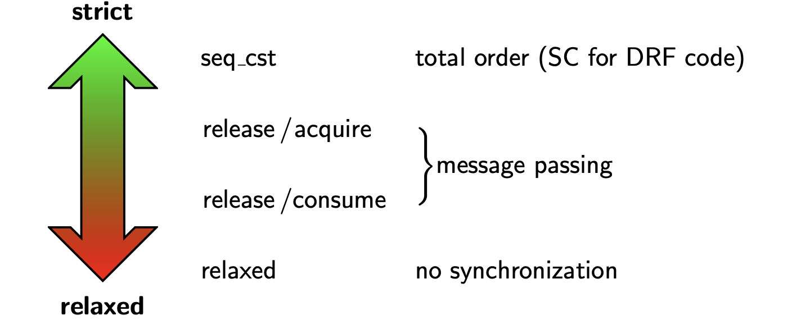

现代计算机体系结构上，CPU执行指令的速度远远大于CPU访问内存的速度，于是引入Cache机制来加速内存访问速度。
除了Cache以外，分支预测和指令预取也在很大程度上提升了CPU的执行速度。
随着SMP的出现，多线程编程模型被广泛应用，在多线程模型下对共享变量的访问变成了一个复杂的问题。
于是我们有必要了解一下内存模型，这是多处理器架构下并发编程里必须掌握的一个基础概念。

## 1. 什么是内存模型？

到底什么是内存模型呢？看到有两种不同的观点：

* A：内存模型是从来描述编程语言在支持多线程编程中对共享内存访问的顺序。
* B：内存模型的本质是指在单线程情况下CPU指令在多大程度上发生指令重排(reorder)[1]。

实际上A，B两种说法都是正确的，只不过是在尝试从不同的角度去说明memory model的概念。
个人认为，内存模型表达为“内存顺序模型”可能更加贴切一点。

一个良好的memory model定义包含3个方面：

* Atomic Operations
* Partial order of operations
* Visable effects of operations

**这里要强调的是**：
我们这里所说的内存模型和CPU的体系结构、编译器实现和编程语言规范3个层面都有关系。

首先，**不同的CPU体系结构内存顺序模型是不一样的**，但大致分为两种：

| Architecture | Memory Model      |
| :----------- | :---------------- |
| x86_64       | Total Store Order |
| Sparc        | Total Store Order |
| ARMv8        | Weakly Ordered    |
| PowerPC      | Weakly Ordered    |
| MIPS         | Weakly Ordered    |
|              |


x86_64和Sparc是强顺序模型（Total Store Order），这是一种接近程序顺序的顺序模型。
所谓Total，就是说，内存（在写操作上）是有一个全局的顺序的（所有人看到的一样的顺序），
就好像在内存上的每个Store动作必须有一个排队，一个弄完才轮到另一个，这个顺序和你的程序顺序直接相关。
所有的行为组合只会是所有CPU内存程序顺序的交织，不会发生和程序顺序不一致的地方[4]。
TSO模型有利于多线程程序的编写，对程序员更加友好，但对芯片实现者不友好。
CPU为了TSO的承诺，会牺牲一些并发上的执行效率。

弱内存模型（简称WMO，Weak Memory Ordering），是把是否要求强制顺序这个要求直接交给程序员的方法。
换句话说，CPU不去保证这个顺序模型（除非他们在一个CPU上就有依赖），
程序员要主动插入内存屏障指令来强化这个“可见性”[4]。
ARMv8，PowerPC和MIPS等体系结构都是弱内存模型。
每种弱内存模型的体系架构都有自己的内存屏障指令，语义也不完全相同。
弱内存模型下，硬件实现起来相对简单，处理器执行的效率也高，
只要没有遇到显式的屏障指令，CPU可以对局部指令进行reorder以提高执行效率。

对于多线程程序开发来说，对并发的数据访问我们一般到做同步操作，
可以使用mutex，semaphore，conditional等重量级方案对共享数据进行保护。
但为了实现更高的并发，需要使用内存共享变量做通信（Message Passing），
这就对程序员的要求很高了，程序员必须时时刻刻必须很清楚自己在做什么，
否则写出来的程序的执行行为会让人很是迷惑！
值得一提的是，并发虽好，如果能够简单粗暴实现，就不要搞太多投机取巧！
要实现lock-free无锁编程真的有点难。

其次，**不同的编程语言对内存模型都有自己的规范**，例如：
C/C++和Java等不同的编程语言都有定义内存模型相关规范。

2011年发布的C11/C++11 ISO Standard为我们带来了memory order的支持，
引用C++11里的一段描述：
```
The memory model means that C++ code now has a standardized
library to call regardless of who made the compiler and on
what platform it's running. There's a standard way to control
how different threads talk to the processor's memory.[7]
```
memory order的问题就是因为指令重排引起的, 指令重排导致 原来的内存可见顺序发生了变化,
在单线程执行起来的时候是没有问题的, 但是放到 多核/多线程执行的时候就出现问题了,
为了效率引入的额外复杂逻辑的的弊端就出现了[8]。

C++11引入memory order的意义在于：**在语言层提供了一个与运行平台无关和编译器无关的标准库，
让我们可以在high level languange层面实现对多处理器对共享内存的交互式控制**。
我们的多线程终于可以跨平台啦！我们可以借助内存模型写出更好更安全的并发代码。
真棒，简直不要太优秀~


C11/C++11使用memory order来描述memory model，
而用来联系memory order的是atomic变量，
atomic操作可以用load()和release()语义来描述。
一个简单的atomic变量赋值可描述为：
```
 atomic_var1.store (atomic_var2.load()); // atomic variables
     vs
 var1 = var2;                            // regular variables
```

为了更好地描述内存模型，有4种关系术语需要了解一下。

### sequenced-before

同一个线程之内，语句A的执行顺序在语句B前面，那么就成为A sequenced-before B。
它不仅仅表示两个操作之间的先后顺序，还表示了操作结果之间的可见性关系。
两个操作A和操作B，如果有A sequenced-before B，除了表示操作A的顺序在B之前，还表示了操作A的结果操作B可见。
例如：语句A是sequenced-before语句B的。

```
r2 = x.load(std::memory_order_relaxed); // A 
y.store(42, std::memory_order_relaxed); // B
```

### happens-before

happens-before关系表示的不同线程之间的操作先后顺序。
如果A happens-before B，则A的内存状态将在B操作执行之前就可见。
happends-before关系满足传递性、非自反性和非对称性。
happens before包含了inter-thread happens before和synchronizes-with两种关系。

### synchronizes-with

synchronizes-with关系强调的是变量被修改之后的传播关系（propagate），
即如果一个线程修改某变量的之后的结果能被其它线程可见，那么就是满足synchronizes-with关系的[9]。
另外synchronizes-with可以被认为是跨线程间的happends-before关系。
显然，满足synchronizes-with关系的操作一定满足happens-before关系了。

### Carries dependency

同一个线程内，表达式A sequenced-before 表达式B，并且表达式B的值是受表达式A的影响的一种关系，
称之为"Carries dependency"。这个很好理解，例如：
```
int *a = &var1;     // A
int *b = &var2;     // B
c = *a + *b;        // C
```
执行语句A和B与语句C之间就存在"Carries dependency"关系，
因为c的值直接依赖于\*a和\*b的值。

了解了上面一些基本概念，下面我们来一起学习一下内存模型吧。

## 2. C11/C++11内存模型

C/C++11标准中提供了6种memory order，来描述内存模型[6]:
```c++
enum memory_order {
    memory_order_relaxed,
    memory_order_consume,
    memory_order_acquire,
    memory_order_release,
    memory_order_acq_rel,
    memory_order_seq_cst
};
```
每种memory order的规则可以简要描述为：

| 枚举值               | 定义规则                                                                 |
| :------------------- | :----------------------------------------------------------------------- |
| memory_order_relaxed | 不对执行顺序做任何保证                                                   |
| memory_order_consume | 本线程中，所有后续的有关本原子类型的操作，必须在本条原子操作完成之后执行 |
| memory_order_acquire | 本线程中，所有后续的读操作必须在本条原子操作完成后执行                   |
| memory_order_release | 本线程中，所有之前的写操作完成后才能执行本条原子操作                     |
| memory_order_acq_rel | 同时包含memory_order_acquire和memory_order_release标记                   |
| memory_order_seq_cst | 全部存取都按顺序执行                                                     |
|                      |


下面我们来举例一一说明，扒开内存模型的神秘面纱。

### 2.1 memory order releaxed

`relaxed`表示一种最为宽松的内存操作约定，Relaxed ordering 仅仅保证load()和store()是原子操作，
除此之外，不提供任何跨线程的同步[5]。

```
                   std::atomic<int> x = 0;     // global variable
                   std::atomic<int> y = 0;     // global variable
		  
Thread-1:                                  Thread-2:
r1 = y.load(memory_order_relaxed); // A    r2 = x.load(memory_order_relaxed); // C
x.store(r1, memory_order_relaxed); // B    y.store(42, memory_order_relaxed); // D
```
上面的多线程模型执行的时候，可能出现r2 == r1 == 42。
要理解这一点并不难，因为CPU在执行的时候允许局部指令重排reorder，D可能在C前执行。
如果程序的执行顺序是 D -> A -> B -> C，那么就会出现r1 == r2 == 42。

如果某个操作只要求是原子操作，除此之外，不需要其它同步的保障，那么就可以使用 relaxed ordering。
程序计数器是一种典型的应用场景：
```c
#include <cassert>
#include <vector>
#include <iostream>
#include <thread>
#include <atomic>

std::atomic<int> cnt = {0};
void f()
{
    for (int n = 0; n < 1000; ++n) {
        cnt.fetch_add(1, std::memory_order_relaxed);
    }
}
int main()
{
    std::vector<std::thread> v;
    for (int n = 0; n < 10; ++n) {
        v.emplace_back(f);
    }
    for (auto& t : v) {
        t.join();
    }
    assert(cnt == 10000);    // never failed
    return 0;
}
```
`cnt`是共享的全局变量，多个线程并发地对`cnt`执行RMW（Read Modify Write）原子操作。
这里只保证`cnt`的原子性，其他有依赖`cnt`的地方不保证任何的同步。

### 2.2 memory order consume

`consume`要搭配`release`一起使用。很多时候，**线程间只想针对有依赖关系的操作进行同步**，
除此之外线程中其他操作顺序如何不关心，这时候就适合用`consume`来完成这个操作。
例如：
```c
b = *a;
c = *b
```
第二行的变量c依赖于第一行的执行结果，因此这两行代码是"Carries dependency"关系。
显然，由于`consume`是针对有明确依赖关系的语句来限定其执行顺序的一种内存顺序，
而`releaxed`不提供任何顺序保证，
所以consume order要比releaxed order要更加地Strong。

```c++
#include <thread>
#include <atomic>
#include <cassert>
#include <string>

std::atomic<std::string*> ptr;
int data;

void producer()
{
    std::string* p  = new std::string("Hello");
    data = 42;
    ptr.store(p, std::memory_order_release);
}

void consumer()
{
    std::string* p2;
    while (!(p2 = ptr.load(std::memory_order_consume)))
        ;
    assert(*p2 == "Hello");  // never fires: *p2 carries dependency from ptr
    assert(data == 42);      // may or may not fire: data does not carry dependency from ptr
}

int main()
{
    std::thread t1(producer);
    std::thread t2(consumer);
    t1.join();
    t2.join();
}
```

assert(*p2 == "Hello")永远不会失败，但assert(data == 42)可能会。
原因是：

* p2和ptr直接有依赖关系，但data和ptr没有直接依赖关系，
* 尽管线程1中data赋值在ptr.store()之前，线程2看到的data的值还是不确定的。

### 2.3 memory order acquire

`acquire`和`release`也必须放到一起使用。
`release`和`acquire`构成了synchronize-with关系，也就是同步关系。
在这个关系下：**线程A中所有发生在release x之前的值的写操作，
对线程B的acquire x之后的任何操作都可见**。

```c++
#include <thread>
#include <atomic>
#include <cassert>
#include <string>
#include <iostream>

std::atomic<bool> ready{ false };
int data = 0;
std::atomic<int> var = {0};

void sender()
{
    data = 42;                                              // A
    var.store(100, std::memory_order_relaxed);              // B
    ready.store(true, std::memory_order_release);           // C
}
void receiver()
{
    while (!ready.load(std::memory_order_acquire))          // D
        ;
    assert(data == 42);  // never failed                    // E
    assert(var == 100);  // never failed                    // F
}

int main()
{
    std::thread t1(sender);
    std::thread t2(receiver);
    t1.join();
    t2.join();
}
```
上面的例子中：

* sender线程中`data = 42`是sequence before原子变量ready的
* sender和receiver在C和D处发生了同步
* 线程sender中C之前的所有读写对线程receiver都是可见的
显然，
`release`和`acquire`组合在一起比`release`和`consume`组合更加Strong！

### 2.4 memory order release

release order一般不单独使用，它和`acquire`和`consume`组成2种独立的内存顺序搭配。

这里就不用展开啰里啰嗦了。

### 2.5 memory order acq_rel

`acq_rel`是acquire和release的叠加。中文不知道该咋描述好：
```
A read-modify-write operation with this memory order is both an acquire operation and a release operation. No memory reads or writes in the current thread can be reordered before or after this store. All writes in other threads that release the same atomic variable are visible before the modification and the modification is visible in other threads that acquire the same atomic variable.
```
大致意思是：

memory_order_acq_rel适用于read-modify-write operation，
对于采用此内存序的read-modify-write operation，我们可以称为acq_rel operation，
既属于acquire operation 也是release operation. 
设有一个原子变量M上的acq_rel operation：
自然的，该acq_rel operation之前的内存读写都不能重排到该acq_rel operation之后，
该acq_rel operation之后的内存读写都不能重排到该acq_rel operation之前. 
其他线程中所有对M的release operation及其之前的写入都对当前线程从该acq_rel operation开始的操作可见，
并且截止到该acq_rel operation的所有内存写入都对另外线程对M的acquire operation以及之后的内存操作可见[13]。

这里是一个例子，关于为什么要有`acq_rel`可以参考一下：

```c++
#include <thread>
#include <atomic>
#include <cassert>
#include <vector>
 
std::vector<int> data;
std::atomic<int> flag = {0};
 
void thread_1()
{
    data.push_back(42);
    flag.store(1, std::memory_order_release);
}
 
void thread_2()
{
    int expected=1;
    while (!flag.compare_exchange_strong(expected, 2, std::memory_order_acq_rel)) {
        expected = 1;
    }
}
 
void thread_3()
{
    while (flag.load(std::memory_order_acquire) < 2)
        ;
    assert(data.at(0) == 42); // will never fire
}
 
int main()
{
    std::thread a(thread_1);
    std::thread b(thread_2);
    std::thread c(thread_3);
    a.join(); b.join(); c.join();
}
```

### 2.6 memory order seq_cst

`seq_cst`表示顺序一致性内存模型，在这个模型约束下**不仅同一个线程内的执行结果是和程序顺序一致的，
每个线程间互相看到的执行结果和程序顺序也保持顺序一致**。
显然，`seq_cst`的约束是最强的，这意味着要牺牲性能为代价。

```
        atomic int x (0);               atomic int y (0);
    x. store (1, seq cst );     ||      y. store (1, seq cst );
    int r1 = y.load( seq cst ); ||      int r2 = x.load( seq cst );
                assert (r1 == 1 || r2 == 1);
```
下面是一个seq_cst的实例：

```c
#include <thread>
#include <atomic>
#include <cassert>
 
std::atomic<bool> x = {false};
std::atomic<bool> y = {false};
std::atomic<int> z = {0};
 
void write_x()
{
    x.store(true, std::memory_order_seq_cst);
}
 
void write_y()
{
    y.store(true, std::memory_order_seq_cst);
}
 
void read_x_then_y()
{
    while (!x.load(std::memory_order_seq_cst))
        ;
    if (y.load(std::memory_order_seq_cst)) {
        ++z;
    }
}
 
void read_y_then_x()
{
    while (!y.load(std::memory_order_seq_cst))
        ;
    if (x.load(std::memory_order_seq_cst)) {
        ++z;
    }
}
 
int main()
{
    std::thread a(write_x);
    std::thread b(write_y);
    std::thread c(read_x_then_y);
    std::thread d(read_y_then_x);
    a.join(); b.join(); c.join(); d.join();
    assert(z.load() != 0);  // will never happen
}
```

### 2.7 Relationship with volatile

**人的一生总是充满了疑惑**。

可能你会思考，volatile关键字能够防止指令被编译器优化，那它能提供线程间(inter-thread)同步语义吗？
答案是：**不能**！！！

* 尽管volatile能够防止单个线程内对volatile变量进行reorder，但多个线程同时访问同一个volatile变量，线程间是完全不提供同步保证。
* 而且，volatile不提供原子性！
* 并发的读写volatile变量是会产生数据竞争的，同时non volatile操作可以在volatile操作附近自由地reorder。

看一个例子，执行下面的并发程序，不出意外的话，你不会得到一个为0的结果。
```c++
#include <thread>
#include <iostream>

volatile int count = 0;

void increase() {
    for (int i = 0; i < 1000000; i++) {
        count++;
    }
}

void decrease() {
    for (int i = 0; i < 1000000; i++) {
        count--;
    }
}

int main() {
    std::thread t1(increase);
    std::thread t2(decrease);
    t1.join();
    t2.join();
    std::cout << count << std::endl;
}
```

如果要进一步理解这个topic，建议可以听一下油管上的大拿视频，可以更好地理解memory model的含义。

## 3. Reference

1. [The C/C++ Memory Model: Overview and Formalization](http://user.it.uu.se/~tjawe125/talks/cpp-memory-model-overview-and-formalization.pdf)
2. [知乎专栏：如何理解C++的6种memory order](https://www.zhihu.com/question/24301047/answer/83422523)
3. [理解 C++ 的 Memory Order](http://senlinzhan.github.io/2017/12/04/cpp-memory-order/)
4. [理解弱内存顺序模型](https://zhuanlan.zhihu.com/p/94421667)
5. [当我们在谈论 memory order 的时候，我们在谈论什么](https://segmentfault.com/p/1210000011132386/read)
6. [https://en.cppreference.com/w/cpp/atomic/memory_order](https://en.cppreference.com/w/cpp/atomic/memory_order)
7. [Youtube: Atomic’s memory orders, what for? - Frank Birbacher [ACCU 2017]](https://www.youtube.com/watch?v=A_vAG6LIHwQ)
8. [C++11中的内存模型下篇 - C++11支持的几种内存模型](https://www.codedump.info/post/20191214-cxx11-memory-model-2/#memory-order-relaxed)
9.  [memory ordering, Gavin's blog](http://gavinchou.github.io/summary/c++/memory-ordering/)
10. [c++11 内存模型解读](https://www.cnblogs.com/liyulong1982/p/5510880.html)
11. [memory barriers in c, MariaDB FOUNDATION, pdf](https://mariadb.org/wp-content/uploads/2017/11/2017-11-Memory-barriers.pdf)
12. [C++ memory order循序渐进](https://blog.csdn.net/wxj1992/java/article/details/103656486)
13. [Memory Models for C/C++ Programers](https://arxiv.org/pdf/1803.04432.pdf)
14. [Memory Consistency Models: A Tutorial](https://www.cs.utexas.edu/~bornholt/post/memory-models.html)