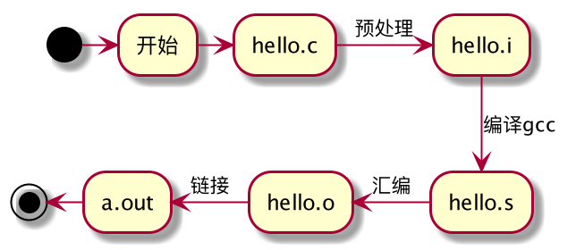

Title:  Understanding the ELF format
Date: 2021-2-8 23:00
Tags: elf
Slug: understanding-elf
Status: draft
Authors: Yori Fang
Summary: ELF

在Unix Like的操作系统上，我们编译程序的源代码后通常会生成一个ELF格式的二进制文件。
ELF文件被操作系统加载后就可以运行，那么你是否好奇在编译、装载和执行背后的逻辑？
本文我们就来一起探索一下ELF文件格式，并了解一下它是如何被操作系统加载和执行的。

这里我们以C语言为例，我们知道源代码在操作系统上运行起来要经历**编译**、**装载**和**执行**这3个步骤。
为了提升程序员的基本修养，我们有必要对这个知识点进行学习。在学习之前准备了几个问题来探讨。

1. c语言编译的基本流程是怎样的？
2. 什么是ELF文件，它的组成结构是怎么样的？
3. 程序链接的时候都做了什么?
4. 什么是符号重定向，为什么需要符号重定向？
5. 链接时重定位和运行时重定位的区别是什么？
6. 什么是GOT/PLT表，为什么需要它？
7. 进程是如何被装载并从哪儿开始执行的？

## 1. 代码编译

源代码的编译主要经历预处理、编译、汇编和链接这4个阶段。预处理主要是对C语言中的一些宏定义进行展开，
编译是将源代码编译成汇编代码，汇编是将汇编代码编译成目标文件，链接则是将一堆目标程序链接成一个可执行程序，
这个可执行程序就是我们说的ELF(Executable and Linkable Format)格式。

| ELF 文件类型       | 说明                                                               |
| :----------------- | :----------------------------------------------------------------- |
| Relocatable File   | 包含代码和数据，可以用来链接成可执行文件或者静态库文件和动态库文件 |
| Executable File    | 可以被直接执行的程序                                               |
| Shared Ojbect File | 包含代码和数据，一种是静态链接库一种是动态链接库                   |
| Core Dump File     | 核心转储文件，进程意外终止时的信息转储文件                         |
|                    |

ELF文件的头部是一个ELF header的数据结构，用来描述整个ELF文件的组成信息。
其中最为重要的是program header table和section header table，
分别存放了**程序表**和**段表**在ELF里面的位置和大小信息。
由于每个section header的大小是固定的，而它们的名称属性不可能一样长，
所以需要一个专门的string section来保存它们的名称属性，
而用来描述这个string section的section header在section表中的位置就由e_shstrndx来确认（e_shoff+ e_shentsize* e_shstrndx），
以达到快速查询的目的。

### 2.链接

源文件经过编译后生成多个独立的目标文件，那么怎么把这些目标文件组合起来拼到一起组成一个完成的可执行程序呢？
答案就是链接！链接的作用其实就是把各个目标文件之间相互引用的部分处理好，
把这些目标文件“粘合”成一个可执行程序。

链接器(linker)对目标文件进行链接，生成可执行程序的时候一般包含2个步骤：

* **地址空间分配**： 扫描输入目标文件，获取各段长度，属性和位置信息，并将所有输入目标文件中的符号定义（Symbol Defination）和
  符号引用（Symbol Reference）收集起来，统一放到全局符号表中。
* **符号解析(Symbol Resolution)和重定位(Relocation)**：读取输入段中的重定位信息并进行符号解析与重定位，修正代码地址。

地址空间分配很好理解，这个阶段链接器扫描所有的目标文件，将目标文件的相同段合并到一起，
计算出整个程序占用的空间大小，在虚拟地址空间内分配一段空间来存放程序的各个段信息。
对于符号解析和重定位而言，可以这么去理解：
译器在编译的时候，由于不知道变量或者函数的目标地址，所以会将操作指令的目标地址空置，
然后为目标文件新增一个重定位段，记录符号的重定位信息，等到链接阶段再计算一个最终地址。

例如，我们有个main.c的程序中使用了另外一个func.c的foo()函数，但是每个源文件都是单独编译的，
编译器在编译的时候并不知道foo()函数的地址，而是暂时把这些调用foo函数的指令目标地址*搁置*，
等待最后链接的时候去将这些指令的目标地址进行*修正*(fixup)。如果没有链接器，需要程序员自己去把   
每个foo的调用指令进行手工修正，填入foo函数的正确地址。这样一来当func.c有发生变动的时候，就要被编译器重新编译，
于是foo函数的地址发生了变化，那么程序员又要将main.c中所有调动foo函数的指令地址更新，
这简直是个令程序员头秃的噩梦！还好我们有链接器，它会自动帮我们查找foo函数的地址，
然后将程序中引用foo函数的指令进行*自动修正*。
我们把这个经过链接器链接后对变量或者函数的地址进行重新修正的入口称之为**重定位入口**（Relocation Entry），
这个地址修正的过程称之为**重定位(Relocation)**。

静态链接和动态链接

地址无关代码：把指令中需要修改的部分分离出来，跟数据部分放到一起，这样指令部分可以保持不变而数据部分可以在每个进程中有一个独立的副本。
理论是抽象的，下面举个具体的例子来进行说明。

### 3.装载

### 4.执行

### 5.Ref

1. https://www.cnblogs.com/fellow1988/p/6158240.html
2. https://blog.csdn.net/npy_lp/article/details/102604380
3. https://www.anquanke.com/post/id/183370
4. https://luomuxiaoxiao.com/?p=125
5. https://zhuanlan.zhihu.com/p/107542184