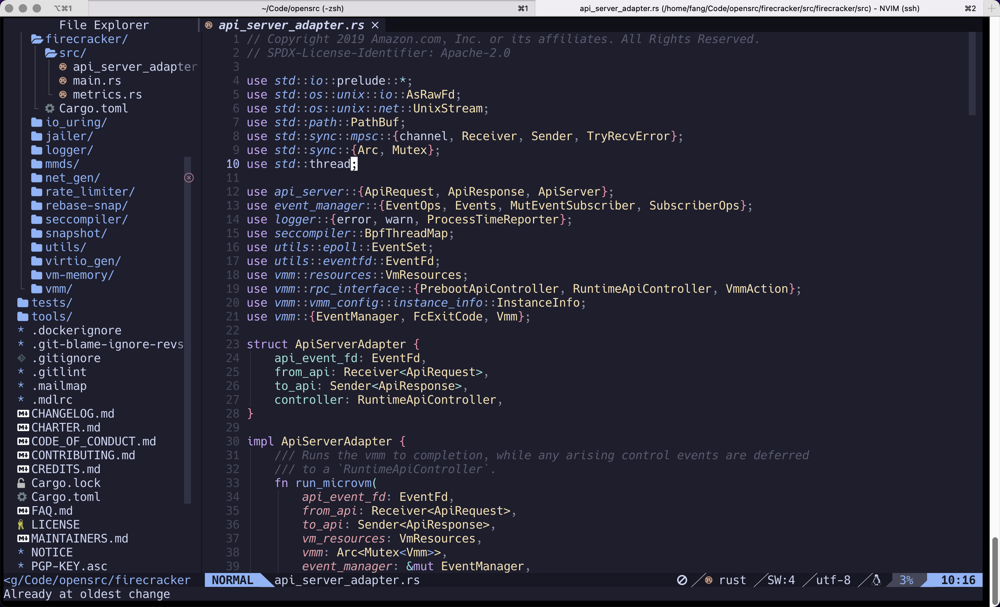

Title: 打造全功能Neovim IDE
Date: 2022-9-03 20:20
Slug: neovim-as-ide



# 前言

自从Neovim和Vim分道扬镳之后，Neovim开始原生支持Lua语言插件并内置了LSP Client，使用体验变的超棒！

本文目的是记录和分享一个全功能的Neovim配置，这个配置几乎可以开箱直用，可以作为程序员的成产力工具。

# 安装

首先你需要安装Neovim到你的操作系统上，建议版本在0.7以上。

```bash
nvim --version
NVIM v0.7.2
Build type: Release
LuaJIT 2.1.0-beta3
Compiled by builduser

Features: +acl +iconv +tui
See ":help feature-compile"

   system vimrc file: "$VIM/sysinit.vim"
  fall-back for $VIM: "/usr/share/nvim"

Run :checkhealth for more info
```

安装好nvim之后，直接clone这个github仓库到本地的`./config`目录下即可：

```bash
git clone https://github.com/fangying/nvim.git ~/.config
```

克隆到本地之后，直接执行nvim命令，nvim会自动执行一下几个步骤完成初始化。

1. 自动调用curl下载Packer.nvim插件管理器；
2. Packer插件管理器自动下载lua/plugins.lua中配置的插件；
3. Packer插件管理器自动编译生产最终的配置文件。

注意：下载安装nvim插件可能会失败或者重试，建议挂上梯子，安装提示重试基本上都能够一次性安装和初始化完成。

