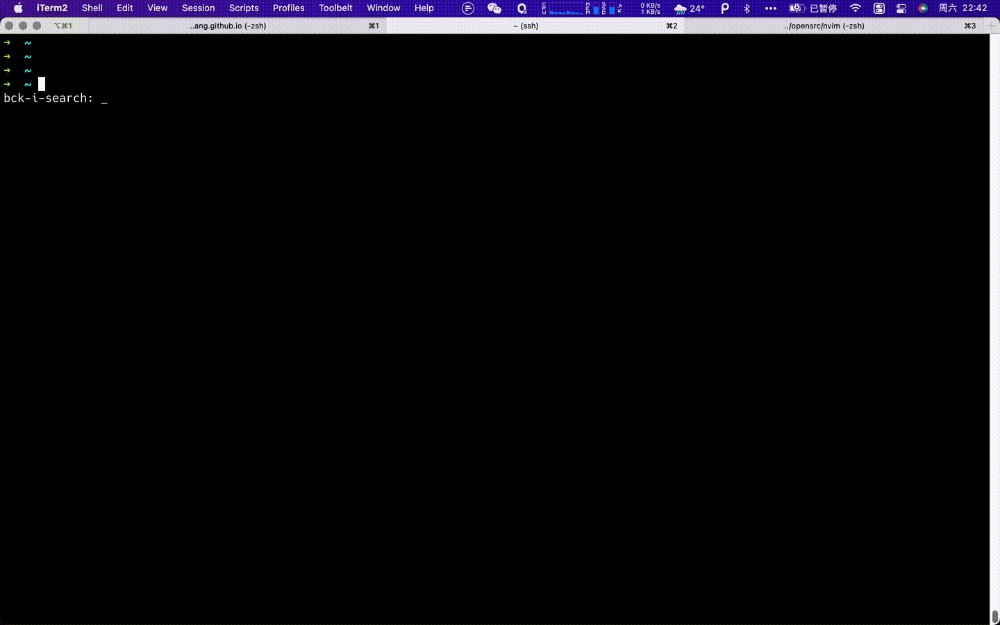
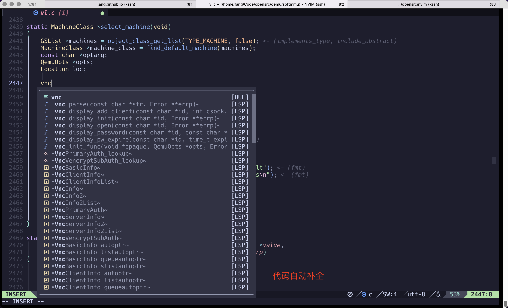
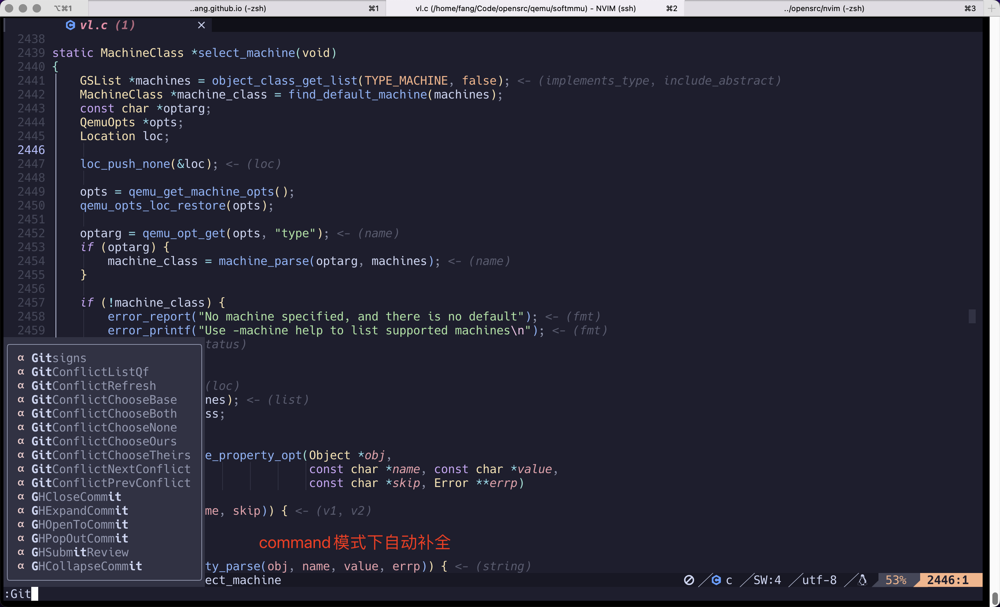
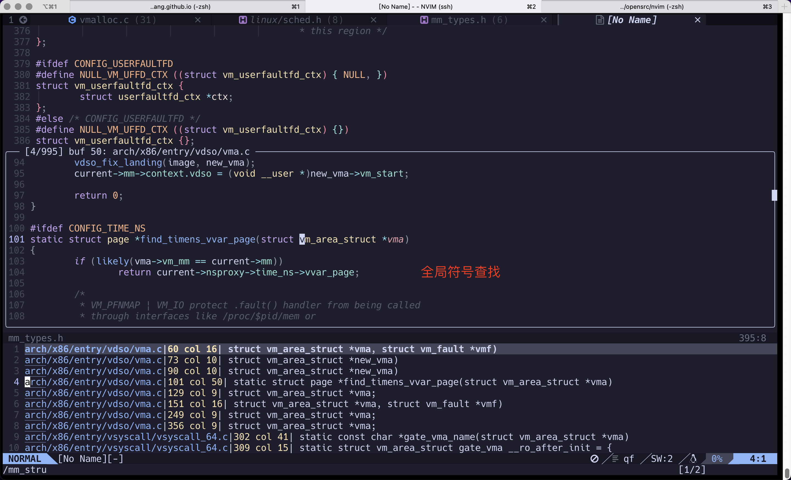
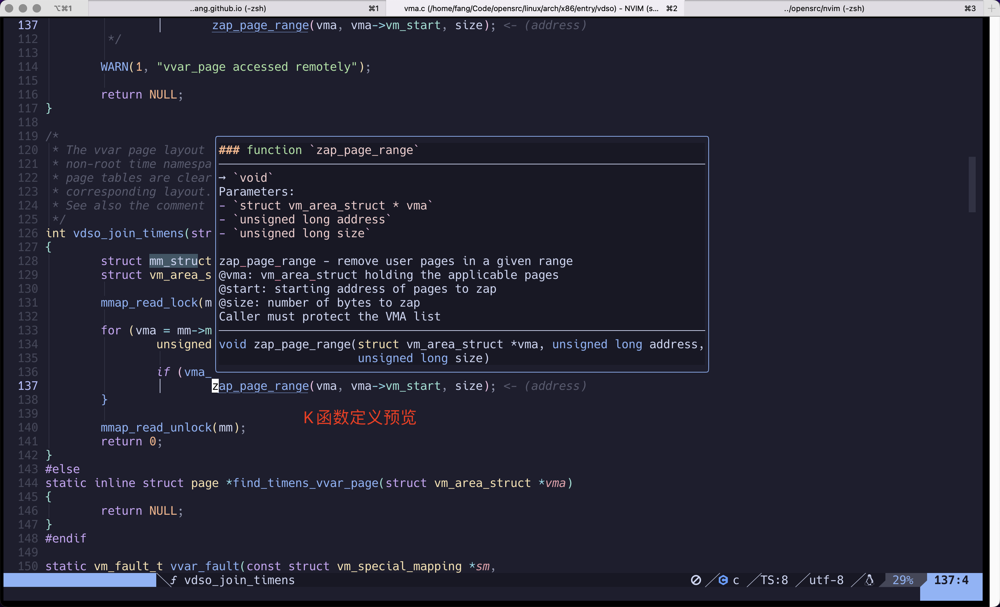
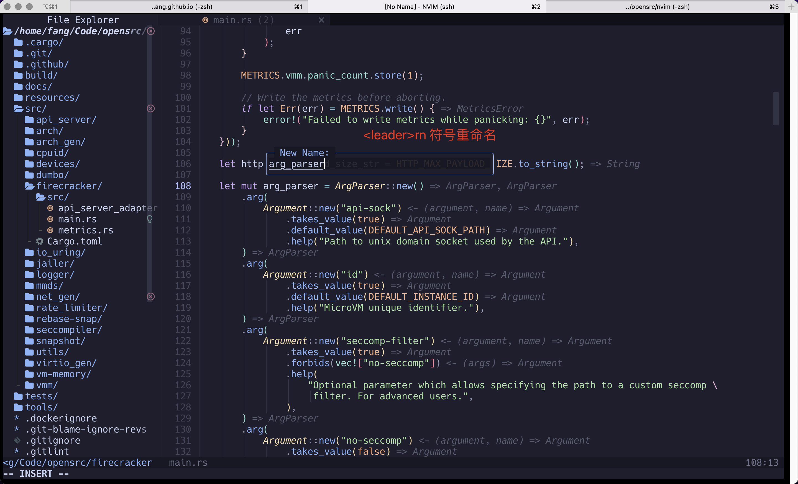
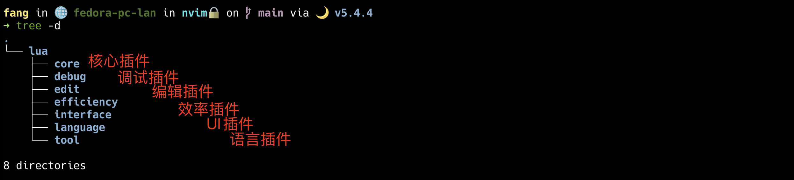

Title: 打造全功能Neovim IDE
Date: 2022-9-03 20:20
Slug: neovim-as-ide


# 1. 前言

自从Neovim和Vim分道扬镳之后，Neovim开始原生支持Lua语言并内置了LSP Client，使用体验变的超级棒！

本文目的是记录和分享一个全功能的Neovim配置，这个配置几乎可以开箱即用，可作为程序员的成产力工具。

# 2. 安装

首先你需要安装Neovim到你的操作系统上，建议nvim版本在0.7以上。

```bash
nvim --version
NVIM v0.7.2
Build type: Release
LuaJIT 2.1.0-beta3
Compiled by builduser

Features: +acl +iconv +tui
See ":help feature-compile"

   system vimrc file: "$VIM/sysinit.vim"
  fall-back for $VIM: "/usr/share/nvim"

Run :checkhealth for more info
```

安装好nvim之后，建议先安装一下gcc，go, nodejs, rustc等开发语言编译工具链和运行环境。

```bash
sudo dnf install -y gcc go nodejs
curl --proto '=https' --tlsv1.2 -sSf https://sh.rustup.rs | sh
```

另外需要安装一下github cli即github的命令行工具，Mason.nvim这个LSP Server管理器默认会用到它。

```bash
# https://github.com/cli/cli/blob/trunk/docs/install_linux.md
sudo dnf install 'dnf-command(config-manager)'
sudo dnf config-manager --add-repo -y https://cli.github.com/packages/rpm/gh-cli.repo
sudo dnf install -y gh
```

接着还需安装一些文件查找辅助工具，例如fd-find，fzf和ripgrep等：

```bash
sudo dnf install -y fd-find fzf ripgrep
```

最后git clone这个github仓库到本地的`./config/nvim`目录下即可：

```bash
mkdir ~/.config
git clone https://github.com/fangying/nvim.git ~/.config/nvim
```

克隆到本地之后，直接执行nvim命令，nvim会自动开始执行以下几个步骤来完成初始化。

1. 自动调用curl下载Packer.nvim插件管理器；
2. Packer插件管理器自动下载lua/plugins.lua中配置的插件；
3. Packer插件管理器自动编译生成最终的配置文件。

**注意**：

* 下载安装nvim插件可能会失败，强烈建议挂上梯子，可能需要多次执行PackerSync命令才能完成初始化。
* Tree-sitter这个插件安装和初始化可能时间会久一点，原因是它会编译和安装一堆语言相关组件。
* 初始化遇到问题不要慌，根据nvim提示仔细排查一般都能够顺利解决。
* 初始化完成后，建议执行`checkhealth`命令，再次检查各插件的依赖是否都安装好了。



# 3. 定制

这个仓库基于[https://github.com/ofseed/nvim/](https://github.com/ofseed/nvim/)进行了一些优化，这是一个非常个性化的配置，可能需要根据个人习惯做一些修改。下面简要介绍一下这个超级配置里的一些核心插件。

### alpha-nvim


这个漂亮的启动界面是alpha-nvim插件提供的，你可以对该插件进行定制。

### telescope.nvim


Telescope.nvim是一个超级插件，它可以为我们提供查找、过滤、预览、选择等功能。其本身还可以集成许多子插件，进一步可以实现项目管理、会话管理等功能。Telescope的默认快捷键配置为：

```bash
<leader>ff 查找文件
<leader>fg 查找符号
<leader>fp 查找项目
<leader>fs 查找代码片段
```

### Tree-Sitter


Tree-sitter是一个语法增量解析器，基于它我们可以实现对代码的语法分析，做到更细粒度的代码高亮。此外它还可以跟LSP进行交互，提供更加丰富的功能。

### Mason.nvim


Mason是一个非常好用的LSP Server管理器，使用Mason我们可以非常方便地下载各种语言的LSP Server，有了它之后再也不用挨个去下载和安装LSP Server。目前常用的编程语言LSP Server在Mason中都有了完备的支持。

### CodeCompletion



有了LSP Server的支持再加上Neovim自带LSP Client，Neovim拥有媲美VsCode般的代码补全和提示功能。










# 4. 扩展



如果需要进一步对上述配置进行扩展，可以阅读一下该配置的核心代码。

* lua/plugins.lua 文件中定义了所有用到的插件集合；
* core文件夹是一些核心插件的独立配置项，可自行扩展；
* edit文件夹是一些代码编辑相关插件配置项，可自行扩展；
* efficiency文件夹是一些效率相关插件的配置项，可自行扩展；
* language是一些LSP Server相关的配置项，可自行扩展；

插件配置的入口文件是`lua/plugins.la`，每个插件可以拥有自己的个性化配置，这些安装插件根据类型分类放到了不通的目录下面，可以根据自己的个性化需求调整部分插件的配置。

# 5. 其他

感谢Yi Ming的分享！

亲，还在等什么？

赶紧开始捣鼓打造属于你自己的Neovim全功能IDE吧！
