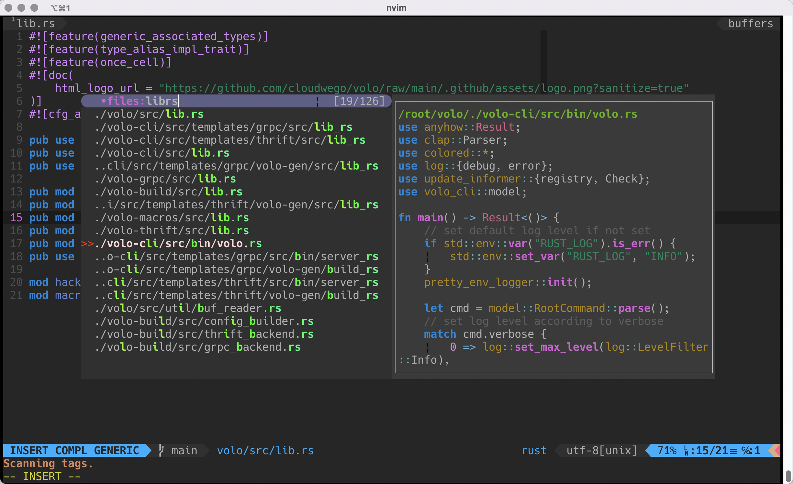
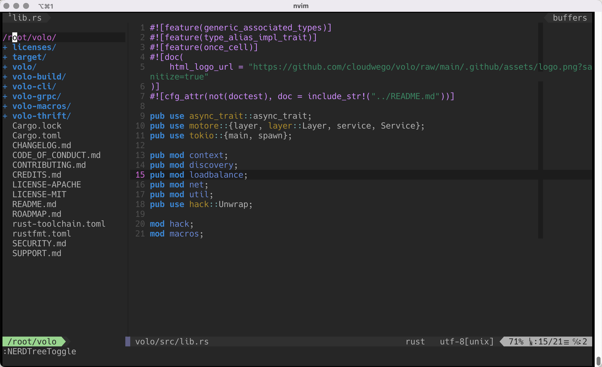

Title: 打造开箱即用的Neovim IDE
Date: 2022-9-04 8:20
Slug: nvim-as-ide

# 1. 前言

自从Neovim横空出世之后，提供了比Vim更好的可扩展性。后来Vim也觉醒了不再固步自封，开始追赶Neovim的步伐。二者之间良性竞争，互相吸纳对方的优点。经过多年的发展，二者之间的差异已经比较小了，大部分三方插件都能同时兼容Neovim和Vim。Neovim和Vim两个项目是开源项目间竞争发展的一个好的例子。

本文的目的是打造一个基于`coc.nvim`的开箱即用的轻量级Neovim IDE。

# 2. 安装

首先需要安装nvim，建议nvim版本至少在0.7以上。

```bash
$ nvim -v
NVIM v0.7.2
Build type: Release
LuaJIT 2.1.0-beta3
Compiled by runner@fv-az164-457

Features: +acl +iconv +tui
See ":help feature-compile"

   system vimrc file: "$VIM/sysinit.vim"
  fall-back for $VIM: "/share/nvim"

Run :checkhealth for more info
```

你需要安装nodejs运行环境，因为这个开箱即用的nvim配置基于`coc.nvim`实现。`coc.nvim`是由赵启明主导开发的一个基于JavaScript的nvim的LSP解决方案，它需要nodejs运行时提供支持。

```bash
wget https://nodejs.org/dist/v16.17.0/node-v16.17.0-linux-x64.tar.xz
tar xf node-v16.17.0-linux-x64.tar.xz -C /usr/local
```

接着安装一些必要的语言编译工具链，还有查找辅助工具fd-find等。

```bash
sudo dnf install -y gcc go nodejs clang llvm
curl --proto '=https' --tlsv1.2 -sSf https://sh.rustup.rs | sh
sudo dnf install -y fd-find fzf ripgrep
```

然后使用我提供的配置文件来，进行初始化即可。这个开箱即用的Neovim配置文件我已经放到了自己的一个dotfiles代码repo中，直接clone下来就可以使用了。

```bash
git clone https://github.com/fangying/dotfiles.git
cd dotfiles
mkdir ~/.config -pv
cp .config/nvim ~/.config -rf
```

dotfiles仓库里面包含了我自己在用的nvim，tmux，alacritty配置文件，这里我们只需要将nvim的文件拷贝到nvim的配置目录即可。拷贝完成后，执行nvim命令会自动下载plug.vim并通过plug.vim插件管理器自动下载其他插件。还是那句话，这个过程会自动去github下载插件，建议挂梯子。


**注意**: 插件自动安装完成之后，建议运行`:checkhealth`命令，安装部分插件缺失的依赖。

# 3. 定制

coc.nvim提供了一站式的LSP服务，集成了众多的语言LSP Server，建议看下`coc.nvim`的项目文档，了解`coc.nvim`的具体使用方法。初始化之后，我们安装一些必要的`coc.nvim`集成的子插件。例如，下面的命令coc会帮忙安装json，rust-analyzer，clangd，go，typescript等语言的LSP Server这样可以支持对语言的自动补全。

```bash
:CocInstall coc-json coc-rust-analyzer coc-clangd coc-go coc-tsserver coc-yaml coc-snippets
```

也可以安装一个叫做coc-marketplace的插件，这样可以用marketplace查看和管理coc的各种插件。

```bash
:CocInstall coc-marketplace
:CocList marketplace
```

查看当前`coc.nvim`当前的配置文件，看下当前LSP Server的配置，执行`CocConfig`命令：


这里默认集成了C语言的LSP Server是ccls，Rust语言使用rust-analyzer，Go语言使用gopls。更多的语言配置可以参考coc的文档：

* [https://github.com/neoclide/coc.nvim/wiki/Language-servers](https://github.com/neoclide/coc.nvim/wiki/Language-servers)

配置好LSP之后，就可以使用nvim了，coc.nvim提功能全面的代码补全功能支持。


代码浏览默认会计键映射：

```bash
gd 查看符号定义
gy 查看类型声明
gi 查看符号的实现
gr 查看符号的调用关系
```

# 4. 使用

这个里面配置一些比较实用的插件，下面挑重点几个简单介绍一下。

### vim-clap



vim-clap提供了非常优秀的查找功能体验，并且可以和`coc.nvim`互相配合打通数据，让文件和符号的查找都十分方便。默认的快捷键配置如下。

```bash
<leader>ff 查找文件
<leader>fg 查找符号
```

### Nerd-Tree



NerdTree是老牌的文件浏览器插件，使用`<leader>e`快捷键打开和关闭NerdTree，使用`?`查看插件的更多用法。

### Airline


Airline插件提供了多Tab支持，使用`<leader>n`快捷键组合快速在多Tab直接无缝切换。

### NerdCommenter


使用nerdcommenter可以帮助我们对选择的代码块进行注释，或者取消注释。

# 5. 其他

参考文件：

* coc插件体系介绍：[https://zhuanlan.zhihu.com/p/65524706](https://zhuanlan.zhihu.com/p/65524706)
* Coc.nvim插件：[https://github.com/neoclide/coc.nvim](https://github.com/neoclide/coc.nvim)