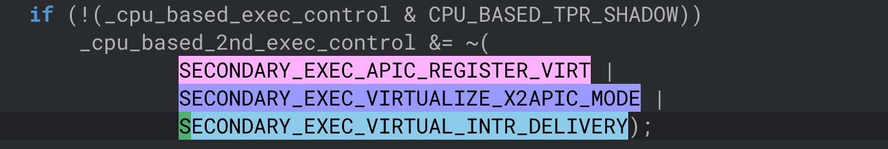
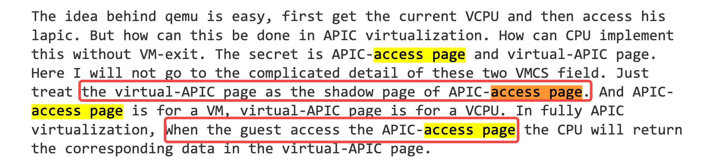
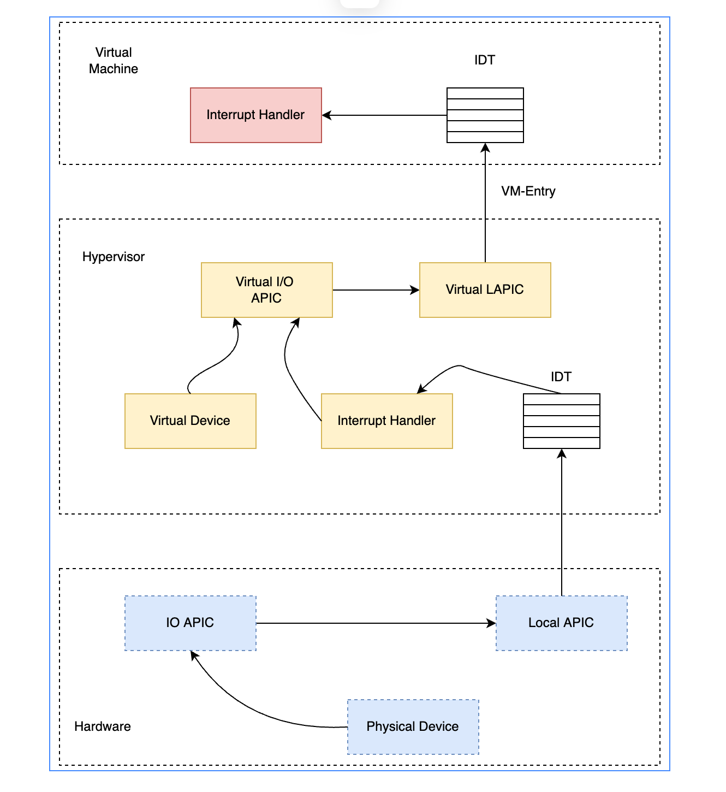

APIC Virtualization Chapter 29

VMCS中跟APIC Virtualization和virtual interrupt相关的有6个：
• virtual-interrupt delivery：控制使能虚拟中断的投递，使能中断的模拟（mmio 或者MSR）方式写APIC寄存器控制中断优先级等。
• Use TPR shadow：控制是否通过CR8寄存器使能 模拟APIC里面的TPR寄存器（包括mmio和MSR两种方式）。
• Virtualize APIC Access：使能mmio方式访问APIC的虚拟化，访问APIC-access page的时候会产生VM Exit。如果设置一些其他的控制域，可以让一些访问被模拟而不是触发VM Exit。
• Virtualize x2APIC mode：使能基于MSR的APIC访问虚拟化。
• APIC-register virtualization：允许在用mmio或者MSR方式读大多数的APIC寄存器的时候通过virtual-apic page直接实现。将mmio模式下写APIC-access page的操作直接转发到virtual-APIC page上，然后发生VM exit到VMM中。
• Process posted interrupts：允许软件直接投递pi descriptor中的虚拟中断和发送通知到其他逻辑处理器。当目标处理器接收到Notification之后，处理器会拷贝pi_desc到virtual-APIC page中并自动处理中断。

每个VM有一个APIC-Access page，每个vcpu的状态则由一个4KB的virtual-APIC page来保存。
每个vcpu的VMCS中有一个地方存放与之对应的virtual-APIC page的物理地址。

setup_vmcs_config 函数负责出时候vmcs配置相关内容hardware_setup  => setup_vmcs_config  
正常情况下，开启了virtualized APIC-Access page之后，需要给每个VM分配一个4kB page。同时把access page的地址写到每个vcpu VMCS对应的apic access page域里面。这样当vcpu在non-root模式访问APIC大部分寄存器的时候都不会退出，访问部分寄存器的时候还是会vm-exit处理但exit-reason是APIC Access Exit而不是MMIO的ept_misconfig出来处理。

虚拟机中断注入的几种方案？
提到了legacy的通过ioapic/pic的方式，CPU之间ipi的方式，MSI的方式等，在虚拟化场景下可以通过apicv和vmcs的方式注入，大体点都讲到了，不过有些细节不是非常了解。

软件中断虚拟化：
软件中断虚拟化：软件模拟实现
•  虚拟IO-APIC：
  • VMM将虚拟IO-APIC的MMIO对应的表项设置为不存在，当虚拟机访问对应的寄存器发生ept missconfig，从而可以被vmm截获；
• 虚拟LAPIC：
  • 根虚拟机IOAPIC类似，截获LAPIC的寄存器请求

