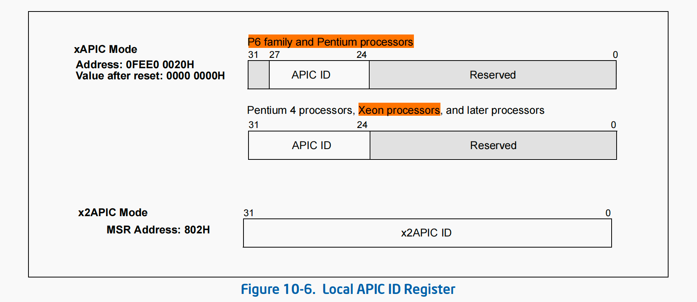
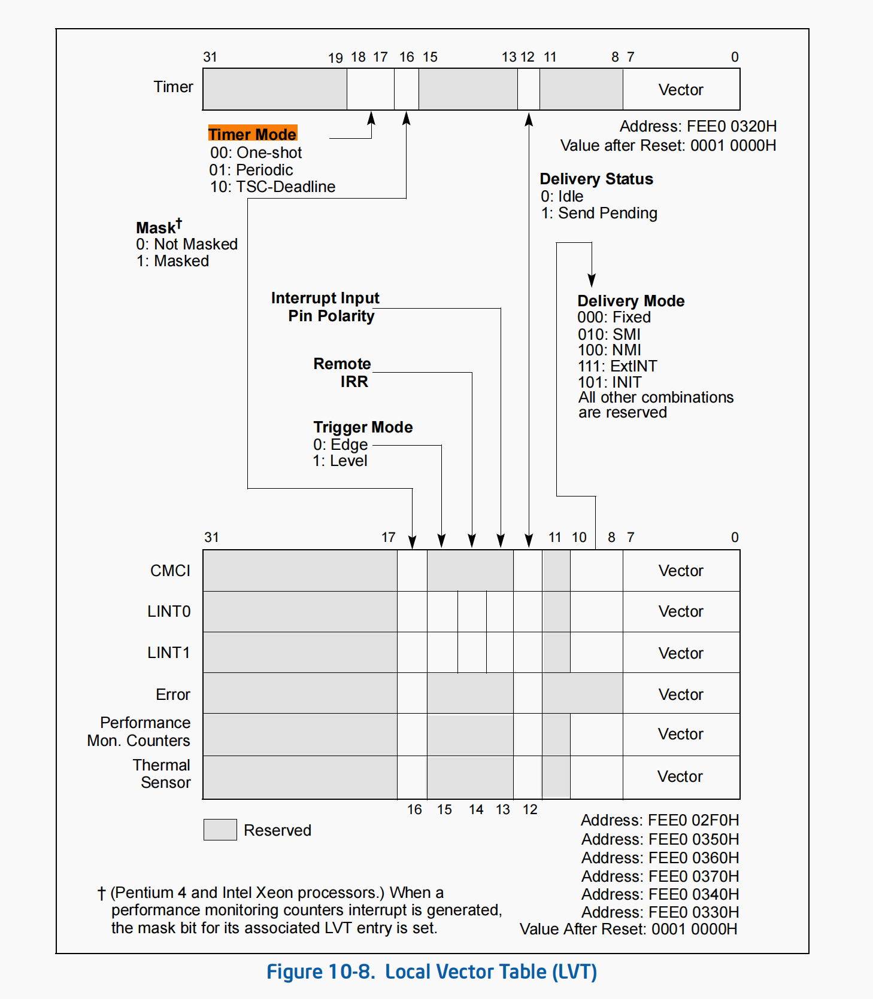
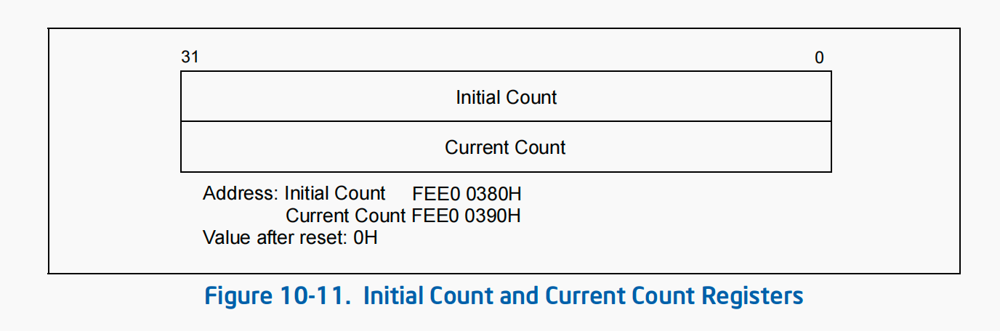
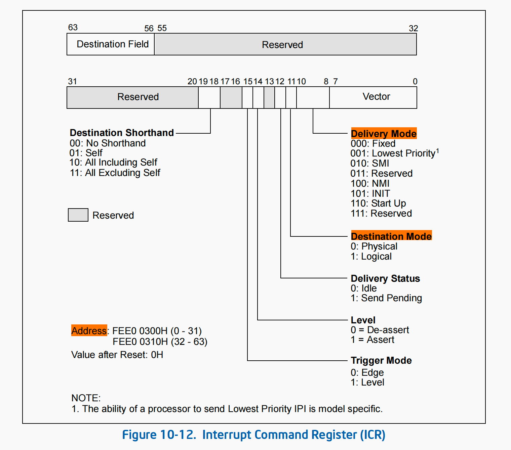
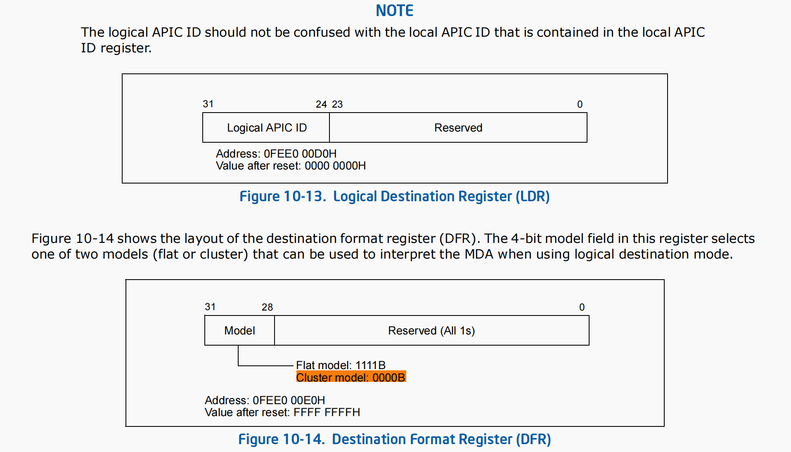
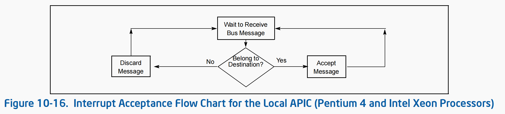
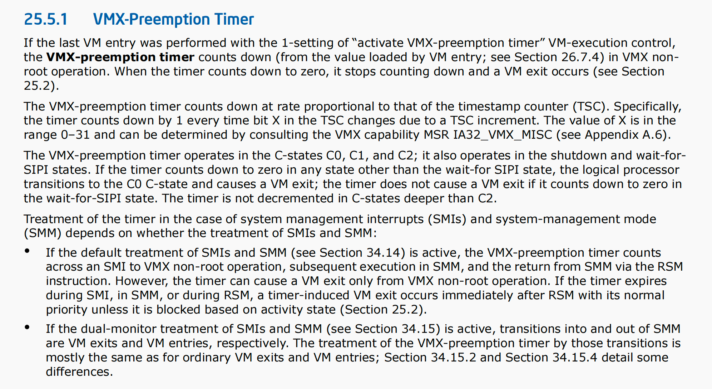

Title: Intel Local APIC学习
Date: 2023-11-20 23:00
Modified: 2023-11-20 23:00
Tags: x86 APIC介绍
Slug: x86_apic
Authors: Yori Fang
Summary: x86 APIC
Status: published

参考文档：

1. TSC介绍：https://wiki.osdev.org/TSC
1. APIC介绍：https://wiki.osdev.org/APIC
1. Intel SDM Vol3 Chapter 10 

Local APIC的2个基本功能：

1. 接受来自处理器中断引脚、内部中断源、和来自外部IOAPIC的中断；
1. 在MP系统中，发送和接收IPI中断；
   
## 10.1 Local and I/O APIC Overview

Local APIC接收的中断来源主要有7个地方：

1. Locally connected I/O devices
1. Externally connected I/O devices
1. Inter-processor interrupts (IPI)
1. APIC Timer generated interrupts
1. Performance monitoring counter interrupts
1. Thermal Sensor interrupts
1. APIC internal error interrupts

Local interrupt source（本地中断源）

the processor’s LINT0 and LINT1 pins, the APIC timer, the performance-monitoring counters, the thermal sensor, and the internal APIC error detector

Local Vector Table （本地中断表）

a group of APIC registers that setup the local interrupt source delivery protocol. A seperate entry is provied in the local vector table for each local interrupt source, which allows a specfic interrupt delivery protocol to be set for each source.
LVT本地中断表：表项用来规定Local APIC对本地中断源发生中断时候对处理方式。

### 10.2-3 APIC BUS vs System BUS, APIC vs xAPIC vs x2APIC

从Intel Pentium 4和Intel Xeon系列开始，I/O APIC和Local APIC是用system bus来进行通信的，老的P6系列cpu是用的apic bus模式（现在已经不适用了）。
APIC架构和xAPIC的区别：

* 最基本的区别是在xAPIC架构下，Local APIC和 I/O APIC使用system bus进行通信；
* xAPIC是Pentium 4 and Intel Xeon processors引入的，APIC架构是在P6处理器上构建的，xAPIC是对APIC的扩展
xAPIC和x2APIC模式的区别：
* x2APIC模式是对xAPIC的扩展。x2APIC向后兼容xAPIC模式，并且支持了cluster索引方式以及MSR方式对APIC寄存器进行访问。
* xAPIC模式下只能通过MMIO方式访问LAPIC寄存器。
* xAPIC模式下APIC ID寄存器只有8bit，那么最大只能支持不超过255个逻辑CPU；

注意：如果逻辑处理器在VMX non-root模式下，使用rdtsc/rdmsr/rdtscp指令读取time-stamp counter的时候可能并不会返回time-stamp counter的实际值。

注意：Local APIC是可以被禁用掉的。

### 10.4 Local APIC
Local APIC整体架构图如下图所示

1. 如何检测是否支持Local APIC？使用CPUID EAX=1，检测是否支持LAPIC
1. 如何Enable/Disable LCAPI？通过 IA32_APIC_BASE MSR去操作

Local APIC的关键MSR：IA32_APIC_BASE_MSR
* 控制Local Vector Table在内存中的基地址；
* Enable和Disable xAPIC和x2APIC模式；
* 可以设置该cpu是否是BSP；

Local APIC ID寄存器

### 10.5 Local Vector Table

LVT的作用主要是用来设置LAPIC本地中断源的处理方式，这些本地中断主要包括以下几个本地中断源。
* LVT CMCI Regsiter
* LVT Timer Register
* LVT Thermal Monitor Register
* LVT Performance Counter Register
* LVT LINT0 Register
* LVT LINT1 Register
* LVT Error Register
  
注意：外部中断的处理方式不是由LVT来设置的，而是由I/O APIC（例如：intel 82093AA）和中断路由表（Interrupt Routing Table）来完成设置。所以这里一定要区分好，本地中断源（ LAPIC + LVT），外部中断源（I/O APIC + Interrupt Routing Table）。

### 10.5.4 APIC Timer

LAPIC Timer是一个32bit可编程定时器。定时器由4个寄存器来编程控制。
* 如果CPUID.06H:EAX.ARAT[bit 2]=1
  * 那么处理器的APIC Timer在所有的P-state下面都以一个恒定的速率运行，即便是deep C-states下面也一样；
* 如果CPUID.06H:EAX.ARAT[bit 2]=0，或者CPUID 06H不支持
  * 那么APIC Timer可能会在deep C-states模式或者Enhanced Intel SpeedStep模式下暂时停止运行。
APIC Timer的定时器频率：
* 处理器的BUS clock
* cyrstal clock frequency除以 divide configuration register

APIC Timer的工作模式Timer Mode有3种：
1. CPUID.01H:ECX.TSC_Deadline[bit 24] = 0，模式由bit 17来决定；
2. CPUID.01H:ECX.TSC_Deadline[bit 24] = 1，模式由bit 18:17来决定；

* One-shot模式：
  * 给initial-count寄存器设置一个初始值，然后这个值会被自动拷贝到current-count寄存器并开始count down；
  * 当current-count递减为0的时候，定时器就给所在的LAPIC发送一个时钟中断；
* Perodic模式：
  * 给inital-count寄存器写一个初始值，然后这个值会被自动拷贝到current-count寄存器并开始count down；
  * 当current-count递减为0的时候，定时器就给所在的LAPIC发送一个时钟中断，并且count down会周期性重复；
* TSC Deadline模式：
  * 软件给IA32_TSC_DEADLINE MSR写一个绝对时间值，当tsc时钟到达该绝对时间到时候就给LAPIC发送一个中断。

Divide Configuration Register

Initial Count 和 Current Count Register（这个寄存器是ReadOnly的）

IA32_TSC_DEADLINE MSR （6E0H）是一个per-logical processor MSR（每个逻辑处理器都有自己的一个）。
当我们给IA32_TSC_DEADLINE写一个非零值的时候就触发了该定时器，当逻辑处理器的TSC到达这个值的时候就触发一个中断。

注意：
1. 每次写IA32_TSC_DEADLINE MSR的时候，最多出发1次时钟中断。
1. TSC和IA32_TSC_DEADLINE都是64bit的。

### 10.6 ISSUING INTERPROCESSOR INTERRUPTS
Interrupt Command Register（ICR）

注意：
* 在XAPIC模式下，ICR寄存器的地址是2个32-bit的寄存器，ICR_LOW（FFE0 0300H）和ICR_HIGH（FFE0_9319H）；
* 在X2APIC模式下，ICR寄存器使用 MSR 830H；

ICR、LDR、DFR寄存器共同来选择IPI投递的目的地并且依赖于选择的destination mode，目前共有4种投递模式：
* physical：使用Local APIC ID指定投递目的地，00H～FEH单播或者FFH广播给所有的APIC；
* logical：
* brodcast/self
* lowest-priority delivery mode
注意：只有P6系列和Pentium处理器才支持flat model。
在Cluster模式下，Destination最多一次可以选中15个Clusters和4个Local APICs，这个模式最对发送消息到60个LAPIC。

Lowest Priority Delivery Mode

### 10.7 System AND APIC BUS ARBITION

当多个Local APIC和I/O APIC同时发送IPI的时候，处理IPI消息的顺序是由bus arbititration决定的。
在Pentium 4和Xeon处理器上，LAPIC和I/O APIC是使用系统仲裁方式来处理IPI的，这个是由硬件决定的软件无法控制。

### 10.8 HANDLING INTERRUPT

在x86架构中，有一些特定类型的中断处理函数结束时不需要显式地写EOI寄存器，因为它们在内部自动处理了EOI。
这些类型的中断处理函数包括：( NMI, SMI, INIT, ExtINT, or SIPI)

1. 异常处理： 当处理器发生异常（如除零异常、页面错误等）时，处理器会自动完成EOI操作。异常处理后，处理器会自动发送EOI信号，释放中断线。
1. NMI中断处理： NMI（Non-Maskable Interrupt）是一种高优先级的中断，它通常用于处理严重的系统故障，如内存校验错误等。当处理NMI中断时，处理器会自动发送EOI信号，释放中断线。
1. 中断处理函数使用iret指令： 当中断处理函数使用iret指令（返回中断返回指令）来返回到中断之前的上下文时，处理器会在iret指令执行时自动发送EOI信号。iret指令包含了完成中断服务例程并恢复中断上下文的操作，同时也会发送EOI信号，使得中断控制器能够继续处理其他中断请求。
需要注意的是，对于使用特定的中断控制器（如APIC）的系统，有时可能需要根据硬件平台或操作系统的具体实现来确定是否需要显式地写EOI寄存器。然而，对于大多数常见的中断类型和通用的操作系统，上述情况是适用的。
如果完成的中断是一个level-triggered interrupt，那么local APIC处理完成中断之后会给所有的I/O APIC发送一个EOI消息。

### 17.17 TIME-STAMP COUNTER
总结一下intel x86架构下的time-stamp counter
Intel x86架构下的时间戳计数器（Time-Stamp Counter，TSC）是一个硬件级别的计时器，用于测量代码的执行时间和性能。TSC通常是一个64位的寄存器，存储了CPU自启动以来经过的时钟周期数。它的特点如下：

1. 计时精度：TSC提供了高精度的计时能力，以时钟周期为单位，因此可以用来测量非常短的时间间隔。
1. 快速访问：由于TSC是一个硬件寄存器，读取操作非常快速，通常只需要几个时钟周期。
1. 恒定时钟频率：TSC的时钟频率是固定的，即在CPU的运行速度不发生变化时，TSC的频率也保持不变。然而，随着技术的发展，一些新型CPU可能支持动态频率调整，需要谨慎处理。
1. 不同核心的同步问题：在多核，不同核心的TSC可能会有一定的差异，导致测量时间不准确。解决这个问题可以使用一些技术，如CPUID指令和内存屏障，来保证TSC的同步性。
1. 不可靠性：在某些情况下，TSC可能不可靠，比如在CPU进入睡眠状态或频率变化时。因此，在使用TSC进行时间测量时，需要小心处理这些情况。
1. 缺少稳定时钟源：TSC通常没有与真实世界时间相关的参考点，因此它不能直接用于测量时间间隔。对于时间戳，可以通过计算两个时间戳之间的差值来得到时间间隔。
总之，Intel x86架构下的时间戳计数器是一个强大的性能计时工具，可以用于测量代码执行时间和性能瓶颈。然而，在使用TSC时需要注意处理多核同步问题和不可靠性，以确保准确的时间测量。

在大多数的传统 x86 架构的处理器中，每个物理核心都有自己的 Time-Stamp Counter（TSC）。因此，如果一个处理器有多个物理核心，那么系统上就会有多个 TSC。在这种情况下，每个核心的 TSC 是独立计数的，它们在不同的核心上的值是不同的。当在多核处理器上执行代码时，要注意这些 TSC 的不同步问题，因为每个核心的 TSC 可能以不同的速度增加。为了解决多核心 TSC 不同步的问题，可以使用 CPUID 指令来获取每个核心的 TSC 的值，并通过时间戳计数器同步策略来保证它们的一致性。

VT-x Preemption Timer
1. 什么是Preemption Timer
Preemption Timer是一种可以周期性使VCPU触发VMExit的一种机制。即设置了Preemption Timer之后，可以使VCPU在指定的TSC cycle(注意文章最后的rate)之后产生一次VM Exit。
使用Preemption Timer时需要注意下面两个问题：

1. 在旧版本的Intel CPU中Preemption Timer是不精确的。在Intel的设计中，Preemption Timer应该是严格和TSC保持一致，但是在Haswell之前的处理器并不能严格保持一致。
1. Preemption Timer只有在VCPU进入到non-root mode时才会开始工作，在VCPU进入VMM时或者VCPU被调度出CPU时，其值都不会变化。

1. 如何使用Preemption Timer
Preemption Timer在VMCS中有三个域需要设置：
1. Pin-Based VM-Execution Controls,Bit 6,”Activate VMX preemption timer”: 该位如果设置为1，则打开Preemption Timer；如果为0，则下面两个域的设置均无效。
1. VM-Exit Controls,Bit 22,”Save VMX-preemption timer value”:This control determines whether the value of the VMX-preemption timer is saved on VM exit.
1. VMX-preemption timer value:This field contains the value that the VMX-preemption timer will use following the next VM entry with that setting. 如果设置了”Save VMX-preemption timer value”，那么在VM exit时会更新该域为新的值。
和Preemption Timer相关的内容去SDM中全文搜索”Preemption Timer”。
在使用时，需要首先设置” Activate VMX preemption timer”和 “VMX-preemption timer value”，如果需要VM exit时保存VMX-preemption timer value的话，需要设置 “Save VMX-preemption timer value”，这样在VCPU因为其他原因VMExit的时候不会重置VMX-preemption timer value。
注意：在由Preemption Timer Time-out产生的VMExit中，是需要重置VMX-preemption timer value的。

VT-x（Virtualization Technology for x86）是英特尔提供的虚拟化技术，允许在同一台物理计算机上同时运行多个虚拟机，每个虚拟机都可以运行不同的操作系统和应用程序。其中，"preemption timer" 是 VT-x 技术的一部分，用于支持虚拟机监控程序（VMM，Virtual Machine Monitor）对虚拟机的调度和控制。
Preemption timer 的作用主要体现在虚拟机的调度和时间分片上，其原理类似于操作系统的时钟中断机制。以下是 preemption timer 的主要作用：

1. 时间分片调度：在一个物理处理器上运行多个虚拟机时，VMM 需要对虚拟机的运行时间进行合理的分配，以确保每个虚拟机都能获得一定的执行时间。Preemption timer 可以设置一个定时器，在每个虚拟机运行一段时间后触发一个中断，VMM 利用这个中断可以强制切换到另一个虚拟机的上下文，从而实现时间分片调度。
1. 虚拟机资源限制：VMM 可以通过控制 preemption timer 的触发频率，限制虚拟机的资源使用。如果一个虚拟机在其分配的时间片内没有完成任务，VMM 可以选择降低其优先级，减少其运行时间，从而保证其他虚拟机也能够获得资源。
1. 避免虚拟机饥饿：通过设置合适的时间片长度，preemption timer 可以避免某个虚拟机长时间占用物理处理器，导致其他虚拟机无法获得足够的执行时间，从而避免虚拟机饥饿现象的发生。
1. 响应性和平滑性：preemption timer 的设置可以影响虚拟机的响应性和平滑性。较短的时间片可以使虚拟机更具有响应性，但可能会引发较大的上下文切换开销；而较长的时间片则可以减少上下文切换，但可能会导致虚拟机响应变慢。
总之，VT-x 中的 preemption timer 在虚拟化环境中起着重要作用，通过时间分片调度和资源限制，它可以有效地管理和控制多个虚拟机的执行，实现资源的合理分配和虚拟机的公平运行。

## 3. Refs

https://www.linux-kvm.org/images/7/70/2012-forum-nakajima_apicv.pdf

https://software.intel.com/en-us/forums/virtualization-software-development/topic/284386

https://www.spinics.net/lists/kvm/msg85565.html

https://cloud.tencent.com/developer/column/75113

https://blog.csdn.net/wanthelping/article/details/47069077
