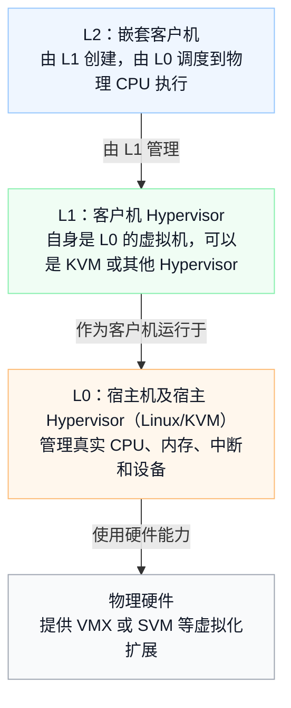
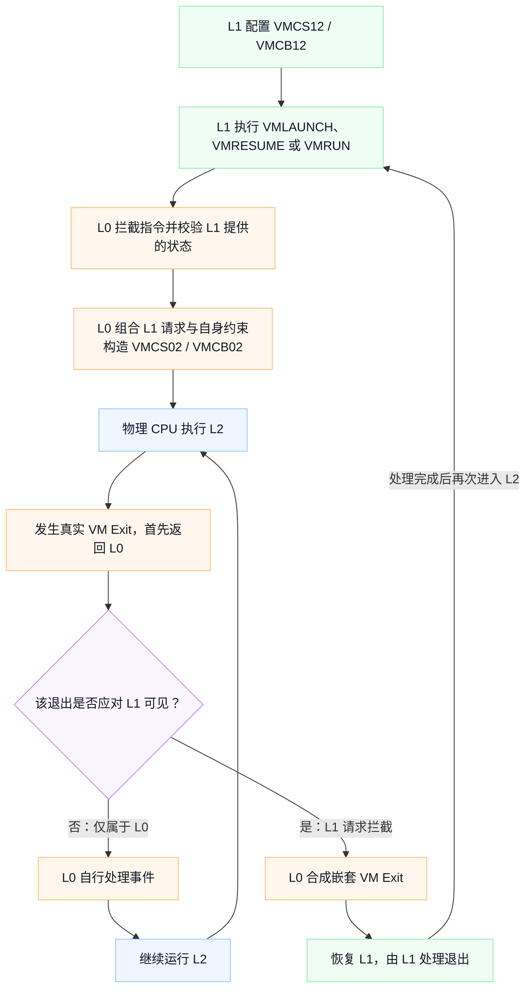
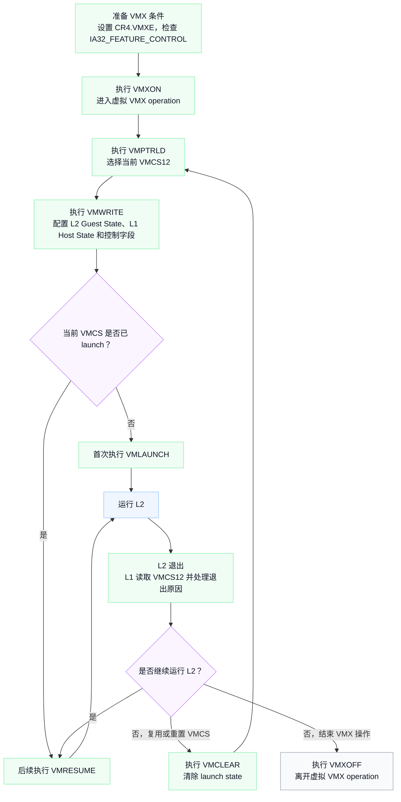
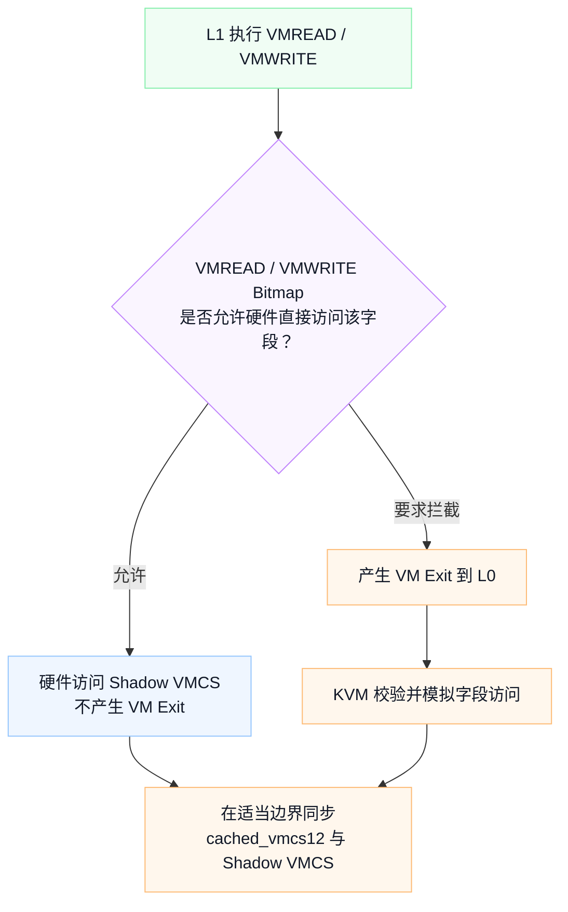
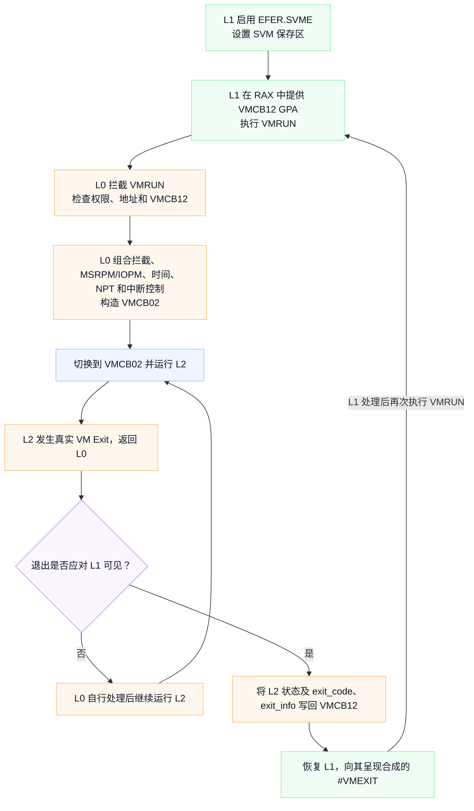
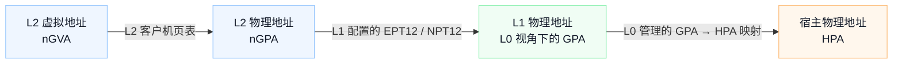
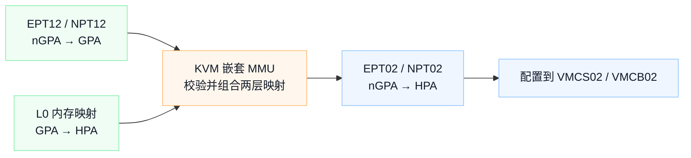
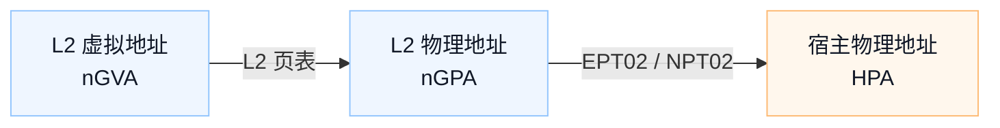

Title: X86 Nested Virtualization
Date: 2026-7-2 23:00
Modified: 2026-7-2 23:00
Tags: virtualization
Slug: x86 nested virtualization
Status: published
Authors: Yori Fang
Summary: x86 nested virtualization


# x86 嵌套虚拟化设计与实现

> 本文以 Linux KVM 的 x86 实现为主，介绍 Intel VMX 与 AMD SVM 的嵌套虚拟化机制。文中的函数名和文件路径以 Linux 主线内核为参照；内核实现会持续演进，阅读具体代码时应同时确认目标内核版本。

## 1. 概述

嵌套虚拟化（Nested Virtualization）是指：一个虚拟机中的客户机 Hypervisor 继续使用硬件虚拟化接口，并运行自己的虚拟机。

在常见的 x86 KVM 场景中，系统分为三层：



这里的 L0 不是“物理硬件”本身，而是运行在裸机上的宿主机和 Hypervisor。L1 也不必一定是 KVM；只要 L0 提供的虚拟 VMX/SVM 接口满足其要求，L1 可以运行其他 Hypervisor。

### 1.1 为什么需要 L0 模拟第二层虚拟化

主流 x86 CPU 通常只向软件暴露一套 VMX 或 SVM 执行层次，不能让 L1 不受控制地直接拥有第二套真实虚拟化硬件。因此，L0 需要完成三件事：

1. 向 L1 暴露一套符合架构规范的虚拟 VMX/SVM 接口。
2. 拦截并模拟 L1 的虚拟化指令和控制结构访问。
3. 将 L1 对 L2 的配置与 L0 自身的安全、调度和隔离要求组合起来，再使用真实硬件运行 L2。

从 L1 的视角看，它像在裸机上一样执行 `VMXON`、`VMLAUNCH` 或 `VMRUN`；从物理 CPU 的视角看，真正控制 VM Entry、VM Exit 和地址空间的仍然是 L0。

### 1.2 启用条件

Linux 内核文档说明，从 Linux 4.20 起，Intel 和 AMD 的 KVM `nested` 参数默认启用，但 Linux 发行版仍可能覆盖默认值。因此，生产环境中不应仅根据内核版本推断功能已经开启，而应检查实际配置：

```bash
# Intel
cat /sys/module/kvm_intel/parameters/nested

# AMD
cat /sys/module/kvm_amd/parameters/nested
```

结果通常为 `Y` 或 `1` 时表示启用。除此之外，还需要把 `vmx` 或 `svm` CPU 特性暴露给 L1。例如 QEMU 可使用宿主 CPU 模型，或选择支持迁移的命名 CPU 模型并显式启用对应特性。

> “模块允许嵌套虚拟化”“L1 能看到 VMX/SVM”“当前 CPU 模型支持 L1 所需的具体特性”是三个不同条件，需要分别确认。

## 2. 总体执行模型

嵌套虚拟化的核心不是简单地“再做一次 VM Entry”，而是把 L1 描述的虚拟机转换成 L0 能安全运行的真实硬件上下文。

以一次 L2 运行周期为例：



因此，“L2 发生退出”不等于“L1 一定能看到退出”。所有真实 VM Exit 都先到达 L0，L0 再根据 L1 的拦截配置和事件来源决定是自行处理，还是反射（reflect）给 L1。

## 3. Intel VMX 嵌套实现

### 3.1 VMCS01、VMCS12 与 VMCS02

Intel VMX 使用 VMCS（Virtual Machine Control Structure）保存客户机状态、宿主状态、执行控制和退出信息。KVM 的嵌套 VMX 实现通常用三组编号描述不同层次：

| 名称 | 创建者与用途 | 关键内容 |
|---|---|---|
| `VMCS01` | L0 创建，用于运行 L1 | Guest State 是 L1；Host State 是 L0 |
| `VMCS12` | L1 为 L2 创建的虚拟 VMCS | Guest State 是 L2；Host State 是 L2 退出后应恢复的 L1 |
| `VMCS02` | L0 构造，用于在真实 CPU 上运行 L2 | Guest State 是 L2；Host State 必须是 L0；控制字段是 L0 与 L1 语义的组合 |

编号中的 `01`、`12`、`02` 可以理解为“从哪一层切换到哪一层”。

从架构接口看，VMCS12 是 L1 客户机物理内存中的一个 VMCS 区域。除了修订号等少数字段，VMCS 对 L1 是不透明的，L1 应通过 `VMREAD` 和 `VMWRITE` 访问它。KVM 内部使用 `struct vmcs12` 表示其已知布局，并缓存当前 VMCS12，以减少重复访问客户机内存。

VMCS02 不是把 VMCS01 与 VMCS12 逐字节拼接起来。它是 L0 根据两层语义重新构造的、可由真实硬件加载的 VMCS。

### 3.2 L1 的 VMX 操作状态

L1 执行的 VMX 操作大致经历以下状态：



“L1 进入 VMX root 模式”是一种容易误解的简写。L1 看到的是 L0 模拟的 VMX root 语义；在真实硬件层面，L1 仍然是由 VMCS01 管理的客户机。

### 3.3 VMX 指令模拟

L0 需要为 L1 实现 Intel VMX 指令规定的成功、`VMfailValid`、`VMfailInvalid` 和异常行为。常见指令的处理逻辑如下：

| 指令 | KVM 的主要工作 |
|---|---|
| `VMXON` | 校验执行条件、VMXON 区域地址和修订号，记录 L1 已进入虚拟 VMX operation；它不等同于“为每个 L2 分配 VMCS12” |
| `VMPTRLD` | 校验目标 VMCS 区域并将其设为当前 VMCS12，必要时在客户机内存与 KVM 缓存之间同步 |
| `VMREAD` / `VMWRITE` | 访问当前 VMCS12；启用 VMCS Shadowing 后，部分字段可由硬件直接处理 |
| `VMCLEAR` | 将目标虚拟 VMCS 转为 clear state，并按架构规则更新其活动状态 |
| `VMLAUNCH` / `VMRESUME` | 检查 launch state、控制字段和 Guest/Host State，准备 VMCS02，然后进入 L2 |
| `INVEPT` / `INVVPID` | 校验操作数，并使相应的嵌套地址翻译或 VPID 上下文失效 |
| `VMXOFF` | 退出 L1 的虚拟 VMX operation，清理或失效相关嵌套状态 |

具体处理函数会随内核重构而变化。阅读代码时应围绕“权限检查—操作数读取—状态校验—执行模拟—设置 VMX 指令结果”这条路径理解，而不应把某个版本的函数名当作稳定 ABI。

### 3.4 VMCS02 的构造

`prepare_vmcs02()` 及其辅助函数负责为 L2 准备真实 VMCS。其组合规则需要按字段语义分别理解。

#### Guest State

VMCS02 的 Guest State 描述真正要执行的 L2，因此主要来自 VMCS12，例如：

- `GUEST_RIP`、`GUEST_RSP`、`GUEST_RFLAGS`
- `CR0`、`CR3`、`CR4`
- 段寄存器、描述符表和活动状态
- L1 请求注入给 L2 的事件

在写入硬件之前，KVM 必须检查保留位、固定值、规范地址、模式组合以及各字段之间的依赖关系。

#### Host State

物理 CPU 从 L2 发生真实 VM Exit 时，必须首先回到 L0，因此 VMCS02 的 Host State 来自 L0，而不是来自 VMCS12。

VMCS12 中的 Host State 仍然有意义：它描述的是 L1 希望在“L2 退出给 L1”时恢复的 L1 状态。L0 合成嵌套 VM Exit 时，会把这些字段装载为新的 L1 Guest State，然后使用 VMCS01 恢复 L1。

#### 执行控制

“所有控制位直接做按位或”并不准确。实际规则包括：

- 对“置 1 表示拦截”的位，若 L0 或 L1 任一方需要拦截，VMCS02 通常必须拦截。
- 对 L0 正确运行或保证隔离所必需的位，L0 可以强制设置。
- 对 L1 请求但真实硬件不支持、KVM 未暴露或不能安全嵌套的位，KVM 必须拒绝 VM Entry 或以软件方式模拟。
- 某些位在 VMCS01 与 VMCS12 中的含义和所有权不同，需要专门计算，不能套用统一公式。
- L1 的请求首先要满足 KVM 暴露给它的虚拟 VMX capability MSR；真实 VMCS02 又必须满足物理 CPU 的 allowed-0/allowed-1 约束。

因此，VMCS02 的控制字段更接近“满足 L0 强制条件后，实现 L1 可见语义的最小安全配置”，而不是简单的：

```text
VMCS02.control = VMCS01.control | VMCS12.control
```

#### 位图

I/O Bitmap 和 MSR Bitmap 的典型目标是：只要 L0 或 L1 需要拦截某项访问，真实执行时就必须产生 VM Exit。概念上可视为拦截集合的并集，但实现还会针对 x2APIC、PMU、用户态 MSR filter 和动态直通等情况做专门处理。

位图合并的首要目的是正确性和隔离；只有当 L0 与 L1 都允许直通时，KVM 才能安全地避免相应退出。

### 3.5 L2 VM Exit 的处理与路由

L2 的真实 VM Exit 永远先进入 L0。L0 随后判断：

- 该退出是否由 L0 自己的控制要求产生；
- L1 是否在 VMCS12 中请求拦截该事件；
- 该事件能否直接注入 L2，或必须先交给 L1；
- 退出信息是否需要转换成 L1 所看到的架构格式。

若退出只需由 L0 处理，例如 L0 自己的调度中断、影子页表缺页或宿主侧维护事件，L0 可以处理完成后直接重新进入 L2，L1 不会看到一次虚假的退出。

若需要反射给 L1，`nested_vmx_vmexit()` 一类逻辑会执行以下工作：

1. 保存 L2 的 Guest State。
2. 把退出原因、退出限定符、中断信息、指令长度等写入 VMCS12。
3. 根据 VMCS12 的 Host State 恢复 L1 应看到的状态。
4. 从 VMCS02 切换回 VMCS01。
5. 恢复 L1，使 L1 的 `VMLAUNCH`/`VMRESUME` 在架构语义上完成，并允许其通过 `VMREAD` 读取退出信息。

这是一场“由 L0 合成给 L1 的 VM Exit”，不是物理 CPU 直接从 L2 跳到 L1。

### 3.6 VMCS Shadowing

VMCS Shadowing 是 Intel 在 Haswell 时代引入的硬件特性，用于降低 L1 执行 `VMREAD`/`VMWRITE` 的退出开销。

其正确工作位置是：L0 运行 L1 时，在 VMCS01 中启用 VMCS Shadowing，并通过 VMCS link pointer 关联一个硬件 Shadow VMCS。VMREAD Bitmap 和 VMWRITE Bitmap 决定哪些字段可以由硬件直接访问，哪些字段仍需退出到 L0。

流程可概括为：



KVM 需要在适当的边界同步 `cached_vmcs12` 与 Shadow VMCS。它也可能为当前 VMCS12 复用每个 vCPU 的硬件 Shadow VMCS，而不是永久地为 L1 创建的每个 VMCS12 分配一份硬件 VMCS。

VMCS Shadowing 只减少适合硬件直访的 `VMREAD`/`VMWRITE` 开销，并不会让 `VMLAUNCH`、`VMRESUME`、VM Entry 检查或嵌套 VM Exit 消失。

### 3.7 概念性伪代码

下面的代码只表达控制流，不是 Linux 内核源码的逐行摘录：

```c
int nested_vmx_enter_l2(struct vcpu *vcpu, struct vmcs12 *vmcs12)
{
    if (!validate_vmx_controls(vmcs12) ||
        !validate_guest_state(vmcs12) ||
        !validate_host_state(vmcs12))
        return emulate_vmentry_failure(vcpu);

    load_l2_guest_state_into_vmcs02(vmcs12);
    load_l0_host_state_into_vmcs02(vcpu);
    compose_execution_controls(vcpu, vmcs12);
    prepare_nested_address_translation(vcpu, vmcs12);

    switch_to_vmcs02(vcpu);
    return enter_hardware_guest_mode(vcpu);
}

void handle_l2_exit(struct vcpu *vcpu)
{
    if (!exit_should_be_visible_to_l1(vcpu)) {
        handle_exit_in_l0(vcpu);
        resume_l2(vcpu);
        return;
    }

    save_l2_state_to_vmcs12(vcpu);
    synthesize_l1_visible_exit_information(vcpu);
    load_l1_state_from_vmcs12_host_fields(vcpu);
    switch_to_vmcs01(vcpu);
    resume_l1(vcpu);
}
```

## 4. AMD SVM 嵌套实现

AMD SVM 使用 VMCB（Virtual Machine Control Block）描述虚拟机。VMCB 是内存中的结构，硬件通过其物理地址加载控制区和保存区。

### 4.1 VMCB01、VMCB12 与 VMCB02

KVM 的命名与 VMX 路径类似：

| 名称 | 用途 |
|---|---|
| `VMCB01` | L0 用来运行 L1 |
| `VMCB12` | L1 在自身客户机物理内存中为 L2 准备的 VMCB |
| `VMCB02` | L0 校验和组合后，交给真实硬件运行 L2 的 VMCB |

“VMCB 是普通内存结构”不表示 L0 可以直接把 L1 提供的 VMCB12 交给硬件。VMCB12 中包含拦截位图、NPT 根地址、事件注入、ASID 和状态字段，这些都来自不可信的 L1。KVM 会先从客户机内存复制和缓存 VMCB12 的控制区/保存区，完成一致性检查，再用 `nested_vmcb02_prepare_control()`、`nested_vmcb02_prepare_save()` 等逻辑准备 VMCB02。

### 4.2 VMRUN 流程

典型 SVM 嵌套流程如下：



VMCB 不需要 VMCS Shadowing 这种专门的 VMREAD/VMWRITE 加速，因为 L1 通过普通内存读写 VMCB。不过，KVM 仍然要处理客户机内存映射、缓存同步、dirty/clean 标记、字段校验和 VMCB02 构造成本。

### 4.3 Intel VMX 与 AMD SVM 对照

| 概念 | Intel VMX | AMD SVM |
|---|---|---|
| 控制结构 | VMCS | VMCB |
| L1 为 L2 准备的结构 | VMCS12 | VMCB12 |
| L0 运行 L2 的结构 | VMCS02 | VMCB02 |
| 进入 L2 | `VMLAUNCH` / `VMRESUME` | `VMRUN` |
| 二维分页 | EPT | NPT |
| TLB 标签 | VPID | ASID |
| 控制结构访问 | `VMREAD` / `VMWRITE` | 普通内存读写 |
| 中断虚拟化 | APICv、Posted Interrupt 等 | AVIC 等 |

AVIC 与 Intel Posted Interrupt/APICv 是两套不同厂商的中断虚拟化机制。不能笼统地断言某一方“更完整”；其能力、嵌套支持程度和启用条件取决于 CPU、内核版本、KVM 配置及客户机模型。

## 5. 嵌套内存虚拟化

### 5.1 地址翻译链

在 L2 开启分页且 L1 使用 EPT/NPT 时，逻辑上存在三段翻译：



KVM MMU 文档将其写作：`ngva -> ngpa -> gpa -> hpa`。

真实 x86 硬件通常只能直接表达传统分页的一段翻译，或传统分页加 EPT/NPT 的两段翻译，无法在每次访存时原生串行执行 L1 的 EPT12 和 L0 的 EPT01。KVM 因此需要把多段翻译折叠为硬件能够执行的结构。

### 5.2 Shadow EPT/NPT：不是硬件连续走两套 EPT

当 L1 为 L2 启用 EPT/NPT 时，KVM 使用嵌套 MMU/Shadow MMU 构造组合后的影子二级页表，常被概念性地称为 EPT02/NPT02：



VMCS02/VMCB02 指向这个由 L0 控制的组合映射。L2 稳定运行时，硬件执行的是：



也就是说，硬件并不是在每次 L2 TLB miss 时先完整遍历 EPT12，再完整遍历 EPT01。额外成本主要来自：

- 首次建立影子映射时，KVM 需要读取和验证 L1 的 EPT12/NPT12；
- L1 修改或失效其二级页表时，KVM 需要同步失效 EPT02/NPT02；
- L0 的 memslot、宿主页或脏页跟踪发生变化时，也需要更新组合映射；
- 某些缺页需要先退出到 L0，再判断是否应反射为 L1 可见的 EPT/NPT 违例。

### 5.3 嵌套页故障的归属

一次 L2 内存访问失败可能有不同原因：

1. **L2 自己的页表不允许访问**：通常形成 L2 自己的 `#PF`。
2. **L1 的 EPT12/NPT12 不允许 nGPA 访问**：L0 应向 L1 合成嵌套 EPT Violation 或 Nested Page Fault。
3. **L1 允许访问，但 L0 的影子映射尚未建立**：L0 可建立映射后继续运行 L2，L1 不应看到虚假退出。
4. **L0 因宿主内存管理、脏页跟踪或 MMIO 需要拦截**：由 L0 处理，必要时退出到用户态设备模型。

正确区分这些来源，是嵌套 MMU 实现中最复杂的部分之一。

### 5.4 L1 未启用 EPT/NPT 的情况

如果 L1 不使用 EPT/NPT，不能认为“L2 GPA 直接等于 L1 HPA”。L1 仍然定义了 L2 所看到的地址空间和访问权限，KVM 需要使用相应的 Shadow Paging 模式，把 L2 页表、L1 地址翻译和 L0 内存映射折叠起来。

这类 shadow-on-shadow 组合通常需要更频繁地跟踪页表写入和失效，性能与实现复杂度也可能高于 L1 使用 EPT/NPT 的情况。

### 5.5 正确理解“25 次内存访问”

“25 次内存访问”是一个经典的、非常理想化的冷页表遍历模型，不是嵌套虚拟化专属常数。

假设：

- 客户机使用四级页表；
- EPT/NPT 也使用四级页表；
- TLB 和所有 page-walk cache 均未命中；
- 不使用大页；
- 把最终数据访问也计入。

那么，普通单层虚拟机从 GVA 访问最终数据时，理论最坏值为：

```text
4 个 Guest PTE：
    每个 PTE 的 GPA 都需要 4 次 EPT 表项读取，
    再读取 PTE 自身
    => 4 × (4 + 1) = 20

最终数据：
    4 次 EPT 表项读取 + 1 次数据访问
    => 5

合计：20 + 5 = 25
```

如果只从 GPA 开始计算 EPT 翻译，则是 4 次 EPT 表项读取加 1 次最终访问，即 5 次。原先把“GPA 到 HPA 的 5 次”与“GVA 到 HPA 的 25 次”直接比较，会混淆计算起点。

对使用 EPT02/NPT02 的嵌套 KVM，硬件稳态页表遍历仍是“L2 页表 + 一套组合后的二级页表”，不能据此推导出嵌套虚拟化固定比普通虚拟化慢 5 倍。真实开销还受以下因素显著影响：

- TLB、paging-structure cache 和 KVM MMU cache 命中率；
- 4 级或 5 级分页；
- 2 MiB/1 GiB 大页；
- EPT/NPT A/D bit；
- L1 修改 EPT12/NPT12 的频率；
- 工作集大小和 NUMA 布局；
- VM Exit、设备模拟和中断密度。

因此，25 适合解释“二维分页的理论冷启动成本”，不适合作为嵌套虚拟化的固定性能倍率。

## 6. 中断、时间与 TLB 虚拟化

### 6.1 中断路由

L2 的中断可能来自 L0 的物理设备、L0 的虚拟中断控制器，或 L1 为 L2 注入的虚拟事件。L0 需要同时满足：

- L0 对物理中断和调度事件的所有权；
- L1 在 VMCS12/VMCB12 中设置的中断窗口和拦截策略；
- L2 当前的中断屏蔽、优先级和可注入状态。

APICv、Posted Interrupt 或 AVIC 在满足硬件与 KVM 条件时可减少部分退出，但嵌套场景仍需要维护 L0、L1、L2 三层中断状态。不能把这些能力理解为“所有中断都绕过 L0”。

### 6.2 VPID 与 ASID

VPID（Intel）和 ASID（AMD）用于给地址翻译缓存打标签，减少不同虚拟 CPU 或不同层次切换时的全量 TLB flush。嵌套场景中，L0 需要为 L2 分配或映射真实标签，并在 L1 执行 `INVVPID`、`INVEPT`、`INVLPGA` 或切换地址空间时维护正确的失效语义。

标签能减少刷新，但不会消除 EPT02/NPT02 失效和重新构造的成本。

### 6.3 时间虚拟化

L0 需要组合 L1 和 L2 的 TSC offset，硬件支持时还要组合或模拟 TSC scaling。组合顺序和精度必须保证：

- L2 看到的是 L1 希望提供的虚拟时间；
- L1 的迁移和暂停语义不被破坏；
- 最终配置仍满足物理 CPU 的硬件限制。

时间虚拟化错误往往表现为时钟倒退、超时异常或迁移后时间漂移，因此也是嵌套状态迁移的重要组成部分。

## 7. 性能分析

### 7.1 主要开销来源

| 开销来源 | 形成原因 | 典型影响 |
|---|---|---|
| VMX/SVM 指令模拟 | L1 的虚拟化操作需要由 L0 校验和模拟 | L2 创建、销毁和频繁切换时明显 |
| L2 Exit 的额外路由 | 所有真实退出先到 L0，再决定是否反射给 L1 | Exit 密集型负载明显 |
| VMCS02/VMCB02 准备 | 复制状态、组合控制、同步位图和地址空间 | VM Entry 路径明显 |
| 影子 EPT/NPT 维护 | 建立、失效和回收组合映射 | 内存映射变化频繁时明显 |
| 中断虚拟化 | 三层中断状态和注入条件需要协调 | 网络、存储和定时器密集型负载明显 |
| TLB 与缓存扰动 | L0/L1/L2 切换会污染 TLB 和 CPU cache | 小工作集低延迟负载也可能敏感 |
| 设备模拟 | L2 I/O 可能穿过 L1 与 L0 两层设备模型 | I/O 密集型负载可能成为主导因素 |

### 7.2 Turtles Project 数据应如何引用

OSDI 2010 的 Turtles Project 论文报告：在其硬件、软件版本和所选常见工作负载上，通过 multi-dimensional paging 等优化，性能可达到相对单层虚拟化约 6%～8% 的额外开销。

这个结果证明了高性能嵌套虚拟化的可行性，但不是现代 KVM、所有 CPU 或所有工作负载的统一上界。引用时应保留“论文环境”“所测工作负载”和“可达到”这些限定条件。

### 7.3 常见优化

- **VMCS Shadowing**：减少部分 `VMREAD`/`VMWRITE` 导致的 L0 退出。
- **VPID/ASID**：减少层次切换和地址空间切换时的 TLB flush。
- **位图缓存与增量合并**：只在 L1 修改 I/O/MSR 拦截配置时重新计算相关位图。
- **EPT/NPT 大页**：减少二级页表层级和 TLB 压力；但组合映射受对齐、权限和宿主内存布局限制，不一定始终能保留大页。
- **APICv、Posted Interrupt、AVIC**：在支持的组合下减少中断相关退出。
- **稳定 CPU 模型**：只向 L1 暴露目标集群共同支持、且 KVM 能正确嵌套的特性，避免迁移时被迫降级或失败。
- **减少 Exit 密度**：对实际业务而言，降低 MMIO、特权指令和高频定时器退出通常比只优化单次 Entry 更有效。

“MSR Bitmap 合并”本身首先是正确性机制。它只有在确认 L0 和 L1 都允许某 MSR 直通时，才可能减少不必要退出。

## 8. 嵌套状态迁移

### 8.1 KVM UAPI

KVM 通过 `KVM_CAP_NESTED_STATE` 表示支持嵌套状态接口。用户态 VMM 可对每个 vCPU 使用：

- `KVM_GET_NESTED_STATE`
- `KVM_SET_NESTED_STATE`

对应的数据结构是 `struct kvm_nested_state`，定义在 `arch/x86/include/uapi/asm/kvm.h`。公共字段包括：

- `format`：VMX 或 SVM；
- `flags`：例如当前是否处于 L2 guest mode、是否有尚未完成的嵌套运行；
- `size`：变长状态的总大小。

VMX 格式还可包含：

- VMXON 区域地址；
- 当前 VMCS12 地址；
- VMCS12 内容；
- Shadow VMCS12 内容；
- 嵌套 SMM 状态；
- VMX preemption timer deadline 等扩展状态。

SVM 格式可包含：

- 当前 VMCB12 地址；
- VMCB12 内容；
- guest PAT、GIF 等嵌套状态。

### 8.2 “L2 正在运行”时如何保存

迁移程序会先让 vCPU 离开 `KVM_RUN` 并达到可保存状态，但这不等于向 L1 人为注入一次嵌套 VM Exit。

若保存时 vCPU 在 L2 guest mode，`KVM_STATE_NESTED_GUEST_MODE` 等标志与嵌套控制结构用于记录这一事实。目标端恢复后，应继续保持与源端一致的 L2/L1 架构状态。如果强行让 L2 退出给 L1，会改变客户机可见行为，通常不是透明迁移应做的事情。

### 8.3 兼容性要求

嵌套迁移不仅要保存普通寄存器，还要保证：

- 目标端支持源端暴露给 L1 的 VMX/SVM 特性；
- VMCS12/VMCB12 的用户态 ABI 与目标内核兼容；
- CPU 模型、MSR、XSTATE、APIC 和时间虚拟化能力匹配；
- 用户态 VMM 按 KVM ABI 要求的顺序恢复普通 vCPU 状态和嵌套状态；
- 所有 vCPU 在一致的暂停点保存，内存脏页同步也已完成。

### 8.4 Intel 与 AMD 的支持边界

Linux KVM 文档说明，Intel x86 上迁移“正在运行 L2 的 L1”从 Linux 5.3 与 QEMU 4.2 起获得支持。

截至本文审阅时，当前 KVM 文档仍明确警告：AMD 系统上，一旦 L1 启动过 L2，在 L2 关闭前不应迁移、`savevm` 或 `loadvm` 该 L1，否则可能出现未定义行为。SVM 已有 `KVM_GET/SET_NESTED_STATE` 数据格式，并不自动意味着所有 QEMU/KVM 版本组合都具备安全的端到端嵌套热迁移能力。

生产环境必须以所用内核、QEMU 和 CPU 型号的实际支持矩阵为准，并进行故障恢复测试。

## 9. VMCS12 的字段组织

`struct vmcs12` 是 KVM 对虚拟 VMCS ABI 的内核表示。为了兼容迁移和保存/恢复，其布局不能随意修改。

| 字段类别 | 代表性字段 | 含义 |
|---|---|---|
| VMCS 区域头 | revision、abort、launch state | VMCS 格式和生命周期状态 |
| Guest State | `guest_rip`、`guest_rsp`、`guest_cr0/3/4` | L2 的处理器状态 |
| Guest 段与描述符表 | selector、base、limit、access rights | L2 的分段状态 |
| Host State | `host_rip`、`host_rsp`、`host_cr0/3/4` | 合成退出给 L1 时应恢复的 L1 状态 |
| 执行控制 | pin-based、primary/secondary processor-based controls | L1 希望硬件或 L0 为 L2 实现的行为 |
| Entry/Exit 控制 | VM-entry、VM-exit controls 和 MSR list | L2 进入、退出时的状态切换要求 |
| 退出信息 | exit reason、qualification、interrupt info | L0 合成嵌套 VM Exit 时写入 |
| EPT | EPT pointer、guest physical address | L1 的 EPT12 根和退出相关地址 |
| VMCS Shadowing | VMCS link pointer、VMREAD/VMWRITE bitmap | 控制 L1 访问 Shadow VMCS；不属于 EPT 字段 |
| APIC/中断 | virtual APIC page、posted-interrupt fields | 虚拟中断和 APIC 加速状态 |

不宜用“约 200 个字段”描述其稳定规模，因为字段会随 VMX 特性和 KVM ABI 演进。更可靠的做法是按 Intel VMX 字段类别和目标内核的 `vmcs12.h` 阅读。

## 10. 代码结构

以下文件是阅读主线实现时的常用入口。行数随版本变化，因此不作为文档内容的一部分。

| 文件 | 主要职责 |
|---|---|
| `arch/x86/kvm/vmx/nested.c` | Nested VMX 指令模拟、VM Entry/Exit、VMCS02 和嵌套 EPT |
| `arch/x86/kvm/vmx/vmcs12.h` | `struct vmcs12`、字段偏移与访问辅助 |
| `arch/x86/kvm/vmx/vmcs_shadow_fields.h` | 可由 Shadow VMCS 加速的字段集合 |
| `arch/x86/kvm/vmx/vmx.h` | VMX vCPU、nested state 和 loaded VMCS 等结构 |
| `arch/x86/kvm/svm/nested.c` | Nested SVM、VMRUN/VMEXIT、VMCB02 和嵌套 NPT |
| `arch/x86/kvm/svm/svm.h` | SVM vCPU、VMCB 和 nested state 数据结构 |
| `arch/x86/kvm/mmu/` | Shadow MMU、TDP MMU、页表遍历和失效 |
| `arch/x86/kvm/x86.c` | x86 KVM 通用 vCPU、ioctl 和架构无关协调逻辑 |
| `arch/x86/include/uapi/asm/kvm.h` | `kvm_nested_state` 等用户态 ABI |

推荐的源码阅读顺序：

1. 从 VMX 的 `handle_vmxon()`、`handle_vmptrld()`、`handle_vmlaunch()`/`handle_vmresume()`，或 SVM 的 `nested_svm_vmrun()` 开始。
2. 跟踪 VMCS02/VMCB02 的准备路径。
3. 跟踪一次 L2 退出，观察“L0 自行处理”和“反射给 L1”的分支。
4. 再进入 `arch/x86/kvm/mmu/`，理解 nGPA 到 HPA 的组合映射。
5. 最后阅读 `KVM_GET_NESTED_STATE`/`KVM_SET_NESTED_STATE`，将运行态与迁移态对应起来。

## 11. 安全性

嵌套虚拟化把 L1 视为不可信输入源。L0 不能直接信任 VMCS12、VMCB12、EPT12/NPT12、位图或 MSR list 中的任何地址和值。

主要安全边界包括：

- **控制字段校验**：检查 fixed bits、保留位、特性依赖和 KVM 实际暴露的能力。
- **Guest/Host State 校验**：检查规范地址、处理器模式、段状态、控制寄存器和事件注入是否合法。
- **客户机地址校验**：确认 VMXON/VMCS/VMCB、位图、MSR list 和嵌套页表均位于 L1 被分配的内存中。
- **内存隔离**：影子 EPT/NPT 只能映射 L0 用户态 VMM 为该虚拟机注册的 memslot，不能让 L1 或 L2 构造任意 HPA。
- **退出路由**：L1 不能通过关闭自己的拦截来绕过 L0 的安全策略、MSR filter 或设备隔离。
- **失效语义**：`INVEPT`、`INVVPID`、`INVLPGA` 和页表写入必须正确传播，避免使用过期权限。
- **状态迁移校验**：`KVM_SET_NESTED_STATE` 恢复的数据同样来自用户态，内核必须验证其格式、标志和字段组合。
- **侧信道缓解**：L0/L1/L2 共享微架构资源，仍需遵守目标 CPU 与内核针对推测执行漏洞的缓解要求。

KVM 的检查被拆分在多个 `nested_vmx_check_*()`、VMCB consistency check、MMU walk 和通用状态校验函数中。不能将安全性归结为某一个 `nested_vmx_check_vmentry()` 函数“校验全部字段”。

## 12. 总结

x86 嵌套虚拟化的本质，是 L0 在只有一层真实 VMX/SVM 硬件能力的前提下，为 L1 提供一套虚拟的硬件虚拟化接口。

需要把握的核心结论是：

1. L0 是宿主 Hypervisor，物理硬件是它的下一层；L1 可以是 KVM，也可以是其他 Hypervisor。
2. VMCS02/VMCB02 是 L0 按字段语义重新构造的真实运行上下文，不是两份控制结构的简单拼接或统一按位或。
3. L2 的所有真实 VM Exit 都先到 L0；只有 L1 应当看到的退出才会被合成并反射给 L1。
4. VMCS Shadowing 加速的是 L1 对部分 VMCS 字段的访问，并且在运行 L1 的 VMCS01 上配置。
5. 嵌套内存翻译的逻辑链是 `ngva -> ngpa -> gpa -> hpa`；KVM 通过 Shadow EPT/NPT 把额外层次折叠成硬件可执行的映射。
6. “25 次访问”是普通二维分页的理论冷页表遍历模型，不能推出嵌套虚拟化固定慢 5 倍。
7. 嵌套状态 API 能保存 VMCS12/VMCB12 和 guest-mode 状态；透明迁移不应人为向 L1 注入一次 L2 VM Exit。
8. 嵌套迁移和高级加速能力具有明显的厂商、CPU、内核与 QEMU 版本边界，部署时必须验证实际支持矩阵。

## 参考资料

1. [Linux KVM：Running nested guests with KVM](https://docs.kernel.org/virt/kvm/x86/running-nested-guests.html)
2. [Linux KVM：Nested VMX](https://docs.kernel.org/virt/kvm/x86/nested-vmx.html)
3. [Linux KVM：The x86 KVM shadow MMU](https://docs.kernel.org/virt/kvm/x86/mmu.html)
4. [Linux KVM API：KVM_GET_NESTED_STATE / KVM_SET_NESTED_STATE](https://docs.kernel.org/virt/kvm/api.html)
5. [Linux 主线源码：arch/x86/kvm/vmx/nested.c](https://github.com/torvalds/linux/blob/master/arch/x86/kvm/vmx/nested.c)
6. [Linux 主线源码：arch/x86/kvm/vmx/vmcs12.h](https://github.com/torvalds/linux/blob/master/arch/x86/kvm/vmx/vmcs12.h)
7. [Linux 主线源码：arch/x86/kvm/svm/nested.c](https://github.com/torvalds/linux/blob/master/arch/x86/kvm/svm/nested.c)
8. [Intel 64 and IA-32 Architectures Software Developer’s Manuals](https://www.intel.com/content/www/us/en/developer/articles/technical/intel-sdm.html)
9. [AMD64 Architecture Programmer’s Manual, Volume 2: System Programming](https://docs.amd.com/v/u/en-US/24593_3.44_APM_Vol2)
10. [The Turtles Project: Design and Implementation of Nested Virtualization, OSDI 2010](https://www.usenix.org/conference/osdi10/turtles-project-design-and-implementation-nested-virtualization)
