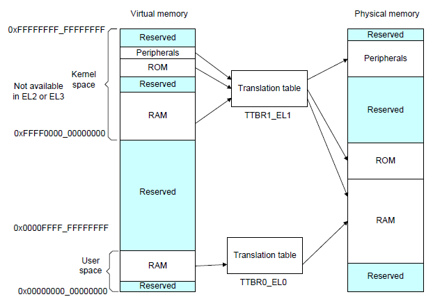
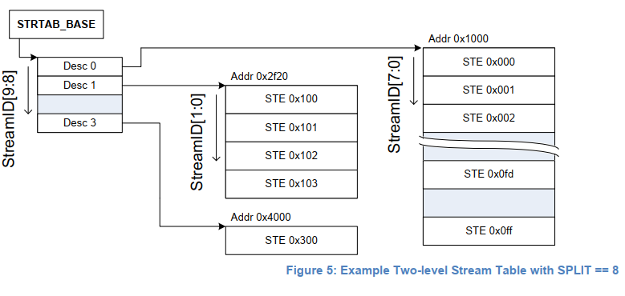
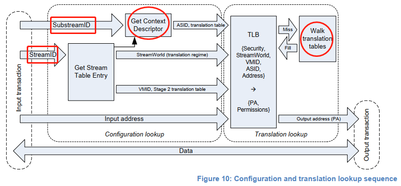
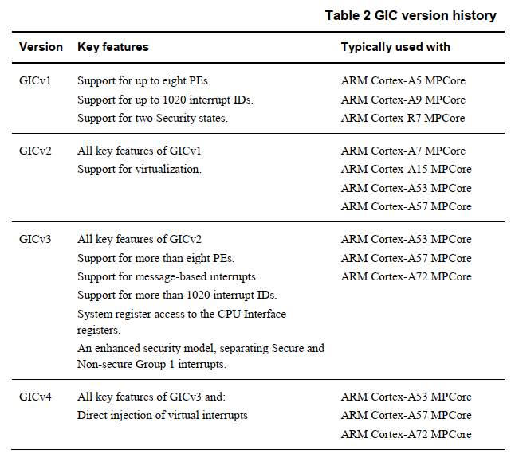
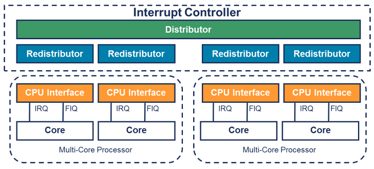

### 摘要：

ARM处理器在移动领域已经大放异彩占据了绝对优势，但在服务器领域当前主要还是X86的天下。
为了能够和X86在服务器领域展开竞争，ARM也逐渐对虚拟化扩展有了较为完善的支持。
本文的目的是介绍一下ARMv8 AArch64处理器的虚拟化扩展中的一些相关知识点，
将主要从ARM体系结构、内存虚拟化、中断虚拟化、I/O虚拟化等几个方面做一些概括总结。
本文将尽可能的在特性层面和X86做一些对比以加深我们对于ARM Virtualizaiton Extension的映像。

### 0. ARMv8 System Architecture

在进入正题之前先回顾一下ARMv8体系结构的一些基本概念。

ARMv8支持两种执行状态：AArch64和AArch32。

AArch64 64-bit执行状态：

* 提供31个64bit的通用处理器，其中X30是Procedure link register
* 提供一个64bit的程序寄存器PC，堆栈指针(SPs)和Exception link registers（ELRs）
* 提供了32个128bit的寄存器以支持SIMD矢量和标量浮点运算
* 定义了4个Exception Level （EL0-EL3）
* 支持64bit虚拟机地址(virtual address)
* 定义了一些PSTATE eletems来存储PE的状态
* 过后ELn缀来表示不同Exception Level下可以操作的系统寄存器

AArch32 32-bit执行状态：

* 提供了13个32bit通用寄存器，1个32bit的PC，SP和Link Register（LR）
* 为Hyper Mode下的异常返回值提供给了一个单一的ELR
* 提供32个64bit的寄存器来支持SIMD矢量和标量浮点运算支持
* 提供了2个指令集，A32和T32,
* 支持ARMv7-A Exception Mode，基于PE modes并且可以对应到ARMv8的Exception model中
* 使用32bit的虚拟地址
* 使用一个单一的CPSR来保存PE的状态

ARM 内存模型：

* 非对齐的内存访问将产生一个异常
* 限制应用程序访问指定的内存区域
* 程序执行中的虚拟地址将被翻译成物理地址
* 内存访问顺序受控
* 控制cache和地址翻译的结构
* 多个PE之间共享内存的访问同步

ARM 内存管理（[参考ARM Address Translation](https://static.docs.arm.com/100940/0100/armv8_a_address%20translation_100940_0100_en.pdf)）：

* ARMv8-A架构支持的最大物理内存地址宽度是48bit，支持4KB、16KB、或者64KB的页面大小
* 使用虚拟内存管理机制，VA的最高有效位（MSB）为0时MMU使用TTBR0的转换表来翻译，VA的最高有效位为1时MMU使用TTBR1的转换表来翻译
* EL2和EL3有TTBR0，但是没有TTBR1，这意味着EL2和EL3下只能使用0x0~0x0000FFFF_FFFFFFFF范围的虚拟地址空间

```
-------------------------------------------------------------------------
AArch64 Linux memory layout with 4KB pages + 4 levels::
  Start			End			Size		Use
  0000000000000000	0000ffffffffffff	 256TB		user
  ffff000000000000	ffffffffffffffff	 256TB		kernel
-------------------------------------------------------------------------
```



OK，假装我们现在的ARMv8-A已经有了一个初步的了解，下面再从几个大的维度去看下ARMv8对虚拟化是怎么支持的。

### 1. ARMv8 Virtualization Extension Overview

ARM为了支持虚拟化扩展在CPU的运行级别上引入了Exception Level的概念，AArch64对应的Exception Level视图如下图：


* EL0：用户态程序的运行级别，Guest内部的App也运行在这个级别
* EL1：内核的运行级别，Guest的内核也运行在这个级别
* EL2：Hypervisor的运行级别，Guest在运行的过程中会触发特权指令后陷入到EL2级别，将控制权交给Hypervisor
* EL3：Monitor Mode，CPU在Secure World和 Normal World直接切换的时候会先进入EL3，然后发生World切换

注：当CPU的Virtualization Extension被disable的时候，软件就运行在EL0和EL1上，这时候EL1有权限访问所有的硬件。

与ARMv8不同的是，在X86为支持CPU虚拟化引入了Root Mode和None-Root Mode的概念和一套特殊的VMX指令集，
其中非根模式是Guest CPU的执行环境，根模式是Host CPU的执行环境。
根模式、非根模式与CPU的特权级别是两个完全独立的概念，二者完全正交，
也就是说非根模式下支持和根模式下一样的用户态（Ring 3）、内核态（Ring 0）特权级。
而这和ARM是不同的，ARM CPU是依靠在不同的EL之间切换来支持虚拟化模式切换。
但二者都有一个相同点:那就是ARM和X86在虚拟化模式下如果执行了敏感指令会分别退出到EL2和Root Mode之间。
同时，X86上为了更好地支持Root/Non-root Mode在内存中实现了一个叫做VMCS的数据结构，
用来保存和恢复Root/None-root模式切换过程中的寄存器信息，VMX指令集则专门用来操作VMCS数据结构。
但在RISC-style的ARM处理器上，则没有类似的实现，而是让Hypervisor软件自己来决定哪些信息需要保存和恢复，
这在一定程度上带来了一些灵活性[[Ref1](http://www.cs.columbia.edu/~cdall/pubs/isca2016-dall.pdf)]。

### 2. Memory Virtualization

在ARMv8-A上，每个tarnslation regime可能包括1个stage，也可能包括2个sate。
每个Exception Level都有自己的地址翻译机制，使用不同的页表基地址寄存器，地址翻译可以细分到stage，
大部分的EL包括一个stage的地址翻译过程， Non-Secure EL1&0包括了2个stage的地址翻译过程。
每个stage都有自己独立的一系列Translation tables，每个stage都能独立的enable或者disable。
每个stage都是将输入地址（IA）翻译成输出地址（OA）[[Ref2](http://www.wowotech.net/memory_management/arm64-memory-addressing.html)]。

所以在虚拟化场景下，ARM和X86上的方案是类似的，都是采用两阶段地址翻译实现GPA -> HPA的地址翻译过程。
虚拟机运行在None-secure EL1&0，当虚拟机内的进程访问GVA的时候MMU会将GVA翻译成IPA（intermediate physical address，中间物理地址：GPA），
这就是所谓的stage 1地址翻译。然后MMU会再次将IPA翻译成HPA，这就是所谓的stage 2地址翻译。


在不同的Eexception Level下有不同的Address Space，那么如何去控制不同地址空间的翻译呢？

ARMv8-A上有一个TCR（Translation Control Register）寄存器来控制地址翻译。
例如：对于EL1&0来说，由于在该运行模式下VA存在2个独立的映射空间（User Space和Kernel Space），
所以需要两套页表来完成地址翻译，这2个页表的及地址分别放在TTBR0_EL1和TTBR1_EL1中。

对于每一个地址翻译阶段:

* 有一个system control register bit来使能该阶段的地址翻译
* 有一个system control register bit来决定翻译的时候使用的大小端策略
* 有一个TCR寄存器来控制整个阶段的地址翻译过程
* 如果某个地址翻译阶段支持将VA映射到两个subranges，那么该阶段的地址翻译需要为每个VA subrange提供不同的TTBR寄存器

内存虚拟化也没有太多可以说道，理解了原理之后就可以去梳理KVM相关代码，相关代码实现主要在arch/arm/mm/mmu.c里面。

### 3. I/O Virtualization 

设备直通的目的是能够让虚拟机直接访问到物理设备，从而提升IO性能。
在X86上使用VT-d技术就能够实现设备直通，这一切都得益于VFIO驱动和Intel IOMMU的加持。
那么在ARMv8-A上为了支持设备直通，又有哪些不同和改进呢？

同X86上一样，ARM上的设备直通关键也是要解决DMA重映射和直通设备中断投递的问题。
但和X86上不一样的是，ARMv8-A上使用的是SMMU v3.1来处理设备的DMA重映射，
中断则是使用GICv3中断控制器来完成的，SMMUv3和GICv3在设计的时候考虑了更多跟虚拟化相关的实现，
针对虚拟化场景有一定的改进和优化。

先看下SMMUv3.1的在ARMv8-A中的使用情况以及它为ARM设备直通上做了哪些改进[[Ref3](https://static.docs.arm.com/ihi0070/b/SMMUv3_architecture_specification_IHI0070B.pdf)]。
SMMUv3规定必须实现的特性有：

* SMMU支持2阶段地址翻译，这和内存虚拟化场景下MMU支持2阶段地址翻译类似，
第一阶段的地址翻译被用做进程（software entity）之间的隔离或者OS内的DMA隔离，
第二阶段的地址翻译被用来做DMA重映射，即将Guest发起的DMA映射到Guest的地址空间内。
* 支持16bit的ASIDs
* 支持16bit的VMIDs
* 支持SMMU页表共享，允许软件选择一个已经创建好的共享SMMU页表或者创建一个私有的SMMU页表
* 支持49bit虚拟地址 (matching ARMv8-A’s 2×48-bit translation table input sizes)，SMMUv3.1支持52bit VA，IPA，PA

SMMUv3支持的可选特性有：

* Stage1和Stage2同时支持AArch32(LPAE: Large Page Address Extension)和AArch64地址翻译表格式（兼容性考虑）
* 支持Secure Stream （安全的DMA流传输）
* 支持SMMU TLB Invalidation广播
* 支持HTTU(Hardware Translation Table Update)硬件自动刷新页表的Access/Dirty标志位
* 支持PCIE ATS和PRI（PRI特性非常厉害，后面单独介绍）
* 支持16K或者64K页表粒度

我们知道，一个平台上可以有多个SMMU设备，每个SMMU设备下面可能连接着多个Endpoint，
多个设备互相之间可能不会复用同一个页表，需要加以区分，SMMU用StreamID来做这个区分，
通过StreamID去索引Stream Table中的STE（Stream Table Entry）。
同样x86上也有类似的区分机制，不同的是x86是使用Request ID来区分的，Request ID默认是PCI设备分配到的BDF号。
不过看SMMUv3 Spec，又有说明：对于PCI设备StreamID就是PCI设备的RequestID，
好吧，两个名词其实表示同一个东西，只是一个是从SMMU的角度去看就成为StreamID，从PCIe的角度去看就称之为RequestID。
同时，一个设备可能被多个进程使用，多个进程有多个页表，设备需要对其进行区分，SMMU使用SubstreamID来对其进行表示。
SubstreamID的概念和PCIe PASID是等效的，这只不过又是在ARM上的另外一种称呼而已。
SubstreamID最大支持20bit和PCIe PASID的最大宽度是一致的。

STE里面都有啥呢？Spec里面有说明：

* STE里面包含一个指向stage2地址翻译表的指针，并且同时还包含一个指向CD（Context Descriptor）的指针
* CD是一个特定格式的数据结构，包含了指向stage1地址翻译表的基地址指针

理论上，多个设备可以关联到一个虚拟机上，所以多个STE可以共享一个stage2的翻译表。
类似的，多个设备(stream)可以共享一个stage1的配置，因此多个STE可以共享同一个CD。

Stream Table是存在内存中的一张表，在SMMU设备初始化的时候由驱动程序创建好。
Stream Table支持2种格式，Linear Stream Table 和 2-level Stream Table，
Linear Stream Table就是将整个Stream Table在内存中线性展开为一个数组，优点是索引方便快捷，缺点是当平台上外设较少的时候浪费连续的内存空间。
2-level Stream Table则是将Stream Table拆成2级去索引，优点是更加节省内存。



在使能SMMU两阶段地址翻译的情况下，stage1负责将设备DMA请求发出的VA翻译为IPA并作为stage2的输入，
stage2则利用stage1输出的IPA再次进行翻译得到PA，从而DMA请求正确地访问到Guest的要操作的地址空间上。

在stage1地址翻译阶段：硬件先通过StreamID索引到STE，然后用SubstreamID索引到CD，
CD里面包含了stage1地址翻译（把进程的GVA/IOVA翻译成IPA）过程中需要的页表基地址信息、per-stream的配置信息以及ASID。
在stage1翻译的过程中，多个CD对应着多个stage1的地址翻译，通过Substream去确定对应的stage1地址翻译页表。
所以，Stage1地址翻译其实是一个（RequestID, PASID） => GPA的映射查找过程。
注意：只有在使能了stage1地址翻译的情况下，SubstreamID才有意义，否则该DMA请求会被丢弃。

在stage2地址翻译阶段：STE里面包含了stage2地址翻译的页表基地址（IPA->HPA）和VMID信息。
如果多个设备被直通给同一个虚拟机，那么意味着他们共享同一个stage2地址翻译页表[[Ref4](https://static.docs.arm.com/ihi0070/b/SMMUv3_architecture_specification_IHI0070B.pdf)]。



值得注意的是：CD中包含一个ASID，STE中包含了VMID，CD和VMID存在的目的是作为地址翻译过程中的TLB Tag，用来加速地址翻译的过程。

系统软件通过Command Queue和Event Queue来和SMMU打交道，这2个Queue都是循环队列。
系统软件将Command放到队列中SMMU从队列中读取命令来执行，同时设备在进行DMA传输或者配置发生错误的时候会上报事件，
这些事件就存放在Event Queue当中，系统软件要及时从Event Queue中读取事件以防止队列溢出。


SMMU支持两阶段地址翻译的目的只有1个，那就是为了支持虚拟化场景下的SVM特性（Shared Virtual Memory）。
SVM特性允许虚拟机内的进程都能够独立的访问直通给虚拟机的直通设备,在进程自己的地址空间内向设备发起DMA。
SVM使得虚拟机里面的每个进程都能够独立使用某个直通设备，这能够降低应用编程的复杂度，并提升安全性。

为了实现虚拟化场景下的SVM，QEMU需要模拟一个vSMMU（或者叫vIOMMU）的设备。
虚拟机内部进程要访问直通设备的时候，会调用Guest驱动创建PASID Table（虚拟化场景下这个表在Guest内部），
在这个场景下PASID将作为虚拟机内进程地址空间的一个标志，设备在发起DMA请求的时候会带上PASID Prefix，这样SMMU就知道如何区分了。
创建PASID Table的时候会访问vSMMU，这样Guest就将PASID Table的地址（GPA）传给了QEMU，
然后QEMU再通过VFIO的IOCTL调用（VFIO_DEVICE_BIND_TASK）将表的信息传给SMMU，
这样SMMU就获得了Guest内部进程的PASID Table的shadow信息，它就知道该如何建立Stage1地址翻译表了。

所以，在两阶段地址翻译场景下，Guest内部DMA请求的处理步骤

```
Step1:  Guest驱动发起DMA请求，这个DMA请求包含GVA + PASID Prefix
Step2： DMA请求到达SMMU，SMMU提取DMA请求中的RequestID就知道这个请求是哪个设备发来的，然后去StreamTable索引对应的STE
Step3:  从对应的STE表中查找到对应的CD，然后用PASID到CD中进行索引找到对应的S1 Page Table
Step4： IOMMU进行S1 Page Table Walk，将GVA翻译成GPA（IPA）并作为S2的输入
Step5： IOMMU执行S2 Page Table Walk，将GPA翻译成HPA，done！
```

纵观SMMUv3，从设计上来和Intel IOMMU的设计和功能基本类似，毕竟这里没有太多可以创新的地方。
但ARM SMMUv3有2个比较有意思的改进点：
一个是支持Page Request Interface（PRI），PRI是对ATS的进一步改进。当设备支持PRI特性的时候，
设备发送DMA请求的时候可以缺页IOPF(IO Page Fault)，这就意味着直通虚拟机可以不需要进行内存预占，
DMA缺页的时候SMMU会向CPU发送一个缺页请求，CPU建立好页表之后对SMMU进行回复，SMMU这时候再将内容写到DMA Buffer中。
另外一个改进就是，DMA写内存之后产生脏页可以由硬件自动更新Access/Dirty Bit，
这样就对直通设备热迁移比较友好，但这个功能是需要厂商选择性支持的，
而且在这种场景下如何解决SMMU和MMU的Cache一致性是最大的挑战。

### 4. Interrupt Virtualization

ARM的中断系统和x86区别比较大，x86用的是IOAPIC/LAPIC中断系统，ARM则使用的是GIC中断控制器，
并且随着ARM的演进陆续出现了GICv2,GICv3,GICv4等不同版本，
看了GICv3手册感觉着玩儿设计得有点复杂，并不像x86上那样结构清晰。



GICv1和GICv2最大只支持8个PE，这放在现在显然不够用了。
所以，GICv3对这里进行改进，提出了*affinity routing*机制以支持更多的PE。

GICv3定义了以下中断类型[[Ref5](https://static.docs.arm.com/dai0492/b/GICv3_Software_Overview_Official_Release_B.pdf)]：
ARM上的中断类型：

* LPI(Locality-specific Peripheral Interrupt) LPI始终是基于消息的中断，边缘触发、经过ITS路由，它们的配置保存在表中而不是寄存器，比如PCIe的MSI/MSI-x中断，GITS_TRANSLATER控制中断
* SGI (Software Generated Interrupt) 软件触发的中断，软件可以通过写GICD_SGIR寄存器来触发一个中断事件，一般用于核间通信（对应x86 IPI中断）
* PPI(Private Peripheral Interrupt)  私有外设中断，这是每个核心私有的中断，PPI太冗长会送达到指定的CPU上，边缘触发或者电平触发、有Active转态，应用场景有CPU本地时钟，类似于x86上的LAPIC Timer Interrupt
* SPI(Shared Peripheral Interrupt)  公用的外部设备中断，也定义为共享中断，边缘触发或者电平触发、有Active转态，可以多个CPU或者说Core处理，不限定特定的CPU，SPI支持Message格式（GICv3），GICD_SETSPI_NSR设置中断，GICD_CLRSPI_NSR清除中断

ARM上的中断又可以分为两类：
一类中断要通过Distributor分发的，例如SPI中断。
另一类中断不通过Distributor的，例如LPI中断，直接经过ITS翻译后投递给某个Redistributor。


INTID       | Interrupt Type | Notes
------------|----------------|------------
0-15        | SGI            |  Banked per PE
16-31       | PPI            |  Banked per PE
32-1019     | SPI            | 
1020-1023   | Special Interrupt Number  | Used to signal special cases
1024-8191   | Reserved       |
8192-       | LPI            | 

ARM上又搞出来一个*Affinity Routing*的概念，GICv3使用*Affinity Routing*来标志一个特定的PE或者是一组特定的PE，
有点类似于x86上的APICID/X2APIC ID机制。ARM使用4个8bit的域来表示affinity，格式如：
```
            <affinity level 3>.<affinity level 2>.<affinity level 1>.<affinity level 0>
```
例如，现在有个ARM Big.Little架构的移动处理器SOC，拥有2个Cluster，小核心拥有4个Cortex-A53大核心拥有2个A72，那么可以表示为：
```
0.0.0.[0:3] Cores 0 to 3 of a Cortex-A53 processor
0.0.1.[0:1] Cores 0 to 1 of a Cortex-A72 processor
```

GICv3的设计上和x86的IOAPIC/LAPIC架构差异甚远，GICv3的设计架构如下图所示：



GICv3中断控制器由Distributor，Redistributor和CPU Interface三个部分组成。
Distributor负责SPI中断管理并将中断发送给Redistributor，Redistributor管理PPI，SGI，LPI中断，并将中断投递给CPU Interface，
CPU Interface负责将中断注入到Core里面（CPU Interface本身就在Core内部）。

Distributor的主要功能有：

* 中断优先级管理和中断分发
* 启用和禁用SPI
* 为每个SPI设置设置中断优先级
* 为每个SPI设置路由信息
* 设置每个SPI的中断触发属性：边沿触发或者电平触发
* 生成消息格式的SPI中断
* 控制SPI中断的active状态和pending状态

每个PE都对应有一个Redistributor与之相连，Distributor的寄存器是memory-mapped，
并且它的配置是全局生效的，直接影响所有的PE。Redistributor的主要功能有：

* 使能和禁用SGI和PPI
* 设置SGI和PPI的中断优先级
* 设置PPI的触发属性：电平触发或者边沿触发
* 为每个SGI和PPI分配中断组
* 控制SGI和PPI的状态
* 控制LPI中断相关数据结构的基地址
* 对PE的电源管理的支持

每个Redistributor都和一个CPU Interface相连， 在GICv3中CPU Interface的寄存器是是通过System registers(ICC_\*ELn)来访问的。
在使用这些寄存器之前软件必须使能系统寄存器，CPU Interface的主要功能：

* 控制和使能CPU的中断处理。如果中断disable了，即使Distributor分发了一个中断事件到CPU Interface也会被Core屏蔽掉。
* 应答中断
* 进行中断优先级检测和中断deassert
* 为PE设置一个中断优先级mask标志，可以选择屏蔽中断
* 为PE定义抢占策略
* 为PE断定当前pending中断的最高优先级（优先级仲裁）

GICv3中为了处理LPI中断，专门引入了ITS（Interrupt Translation Service）组件。
外设想发送LPI中断时（比如PCI设备的MSI中断），就去写ITS的寄存器GITS_TRANSLATER，这个写操作就会触发一个LPI中断。
ITS接收到LPI中断后，对其进行解析然后发送给对应的redistributor，然后再由redistributor发送给CPU Interface。
那么这个写操作里面包含了哪些内容呢？主要是2个关键域。

* EventID：这个是写入到GITS_TRANSLATER的值，EventID定义了外设要触发的中断号，EventID可以和INTID一样，或者经过ITS翻译后得到一个INTID
* DeviceID：这个是外设的标志，实现是自定义的，例如可以使用AXI的user信号传递。


ITS使用3种类型的表来完成LPI的翻译和路由：

* Device Table： 将DeviceID映射到Interrupt Translation Table中
* Interrupt Translation Table：包含了EventID到INTID映射关系之间和DeviceID相关的信息，同时也包含了INTID Collection
* Collection Table：将collections映射到Redistributor上


整个流程大概是：
```
Step1： 外设写GITS_TRANSLATER，ITS使用DeviceID从Device Table中索引出这个外设该使用哪个Interrupt Translation Table
Step2： 使用EventID去选中的Interrupt Translation Table中索引出INTID和对应的Collection ID
Step3： 使用Collection ID从Collection Table中选择对应的Collection和路由信息
Step4： 把中断送给目标Redistributor
```
看来看去总觉得GICv3中断控制器设计比较复杂，不如x86上那样结构清晰，目前只是理了个大概，要深入理解再到代码级熟悉还得花不少时间。
上面说了这么多，还是在将GICv3控制器的逻辑，具体QEMU/KVM上是怎么实现的还得去看代码，为了提升中断的性能，
GICv3的模拟是直接放到KVM里面实现的。比如说virtio设备的MSI中断，那肯定类型上是LPI中断，QEMU模拟的时候机制上还是使用irqfd方式来实现的，
前面也有从代码角度去分析过，后面再单独从代码层级去分析具体的实现方案。

### 5. Overview
ARM体系结构和x86存在不少差异，其中差异最大的还是中断控制器这块，这里需要投入事件好好分析一下．
内存虚拟化和I/O虚拟化这块二者可能细节上有些不同，但背后的原理还是近似的．
例如：SMMUv3在设计上和Intel IOMMU都支持了二次地址翻译，但SMMU有针对性的改进点．
后面继续努力，慢慢入门学习ARM虚拟化的知识体系．

### 6. References

1. [ARMv8 Architecture Reference Manual](https://developer.arm.com/documentation/ddi0487/latest)
1. [ARMv8-A Address Translation Version 1.0](https://static.docs.arm.com/100940/0100/armv8_a_address%20translation_100940_0100_en.pdf)
1. [ARM64 Address Translation](http://www.wowotech.net/memory_management/arm64-memory-addressing.html)
1. [SMMU architecture version 3.0 and version 3.1](https://static.docs.arm.com/ihi0070/b/SMMUv3_architecture_specification_IHI0070B.pdf)
1. [GICv3 Software Overview Official Release](https://static.docs.arm.com/dai0492/b/GICv3_Software_Overview_Official_Release_B.pdf)
1. [SVM on ARM SMMUv3](https://blog.linuxplumbersconf.org/2017/ocw/system/presentations/4812/original/plumbers17-smmu-svm.pdf)
1. [SVM and PASID](https://lwn.net/Articles/747230/)
