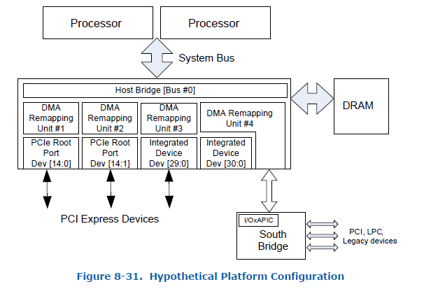

Title: Intel IOMMU Introduction
Date: 2018-5-20 23:00
Modified: 2018-5-24 23:00
Tags: virtualization
Slug: intel_iommu
Authors: Yori Fang
Summary: Intel IOMMU


对于Intel的硬件辅助虚拟化方案而言核心的两大技术分别是VT-x和VT-d。
其中VT-x中主要引入了non-root模式(VMCS)以及EPT页表等技术，主要关注于vCPU的虚拟化和内存虚拟化。
而VT-d的引入则是重点关注设备直通(passthrough)方面（即IO虚拟化）。

VT-x中在non-root模式下，MMU直接使用EPT page table来完成GPA->HVA->HPA的两级翻译，
VT-d中在non-root模式下，则由IOMMU来使用Context Table和IOMMU page table完成设备DMA请求过程中的HPA->HVA->GPA的翻译．
二者极为相似，唯一的不同之处在于CPU访问内存（直通设备IO Memory）是通过MMU查找EPT页表完成地址翻译，
而直通设备访问内存的请求则是通过IOMMU查找IOMMU页表来完成地址翻译的。本文重点来探索一下Intel IOMMU的工作机制。

## 硬件结构 ##

先看下一个典型的X86物理服务器视图：



在多路服务器上我们可以有多个DMAR Unit（这里可以直接理解为多个IOMMU硬件），
每个DMAR会负责处理其下挂载设备的DMA请求进行地址翻译。
例如上图中，
PCIE Root Port (dev:fun) (14:0)下面挂载的所有设备的DMA请求由DMAR #1负责处理，
PCIE Root Port (dev:fun) (14:1)下面挂载的所有设备的DMA请求由DMAR #2负责处理，
而DMAR #3下挂载的是一个Root-Complex集成设备[29:0]，这个设备的DMA请求被DMAR #3承包，
DMAR #4的情况比较复杂，它负责处理Root-Complex集成设备[30:0]以及I/OxAPIC设备的DMA请求。
这些和IOMMU相关的硬件拓扑信息需要BIOS通过ACPI表呈现给OS，这样OS才能正确驱动IOMMU硬件工作。

关于硬件拓扑信息呈现，这里有几个概念需要了解一下：

1.  DRHD: DMA Remapping Hardware Unit Definition 用来描述DMAR Unit(IOMMU)的基本信息
2.  RMRR: Reserved Memory Region Reporting 用来描述那些保留的物理地址，这段地址空间不被重映射
3.  ATSR: Root Port ATS Capability 仅限于有Device-TLB的情形，Root Port需要向OS报告支持ATS的能力
4.  RHSA: Remapping Hardware Static Affinity Remapping亲和性，在有NUMA的系统下可以提升DMA Remapping的性能

BIOS通过在ACPI表中提供一套DMA Remapping Reporting Structure
信息来表述物理服务器上的IOMMU拓扑信息，
这样OS在加载IOMMU驱动的时候就知道如何建立映射关系了。

附：我们可以使用一些工具将ACPI表相关信息Dump出来查看
```bash
# acpidump --table DMAR -b > dmar.out
# iasl -d dmar.out
# cat dmar.dsl
```

## 数据结构 ##

Intel IOMMU Driver的关键数据结构可以描述为（[点击链接查看原图](https://kernelgo.org/images/iommu-data-structure.svg)）：


按照自上而下的视图来看，首先是IOMMU硬件层面，
struct dmar_drhd_unit数据结构从系统BIOS角度去描述了一个IOMMU硬件：

* list  用来把所有的DRHD串在一个链表中便于维护
* acpi_dmar_head *hdr   指向IOMMU设备的ACPI表信息
* device_cnt    表示当前IOMMU管理的设备数量
* include_all   表示该IOMMU是否管理平台上所有的设备（单IOMMU的物理物理服务器）
* reg_base_addr 表示IOMMU的寄存器基地址
* intel_iommu *iommu    指针指向struct intel_iommu数据结构
* struct intel_iommu    进一步详细描述了IOMMU的所以相关信息
* cap和ecap 记录IOMMU硬件的Capability和Extended Capability信息
* root_entry    指向了此IOMMU的Root Entry Table
* ir_table  指向了IOMMU的Interrupt Remapping Table（中断重映射表）
* struct iommu_device iommu 从linux设备驱动的角度描述这个IOMMU并用来绑定sysfs
* struct dmar_domain ***domains 比较关键，它记录了这个IOMMU下面管理的所有dmar_domain信息

在虚拟化场景下多个设备可以直通给同一个虚拟机，他们共享一个IOMMU Page Table，
这种映射关系就是通过DMAR Domain来表述的，
也就是说多个直通设备可以加入到一个DMAR Domain中，
他们之间使用同一套页表完成地址DMA
请求的地址翻译。
那我们接着往下走，来看DMAR Domain：

* struct dmar_domain    数据结构用来描述DMAR Domain这种映射关系的
* struct list_head devices  链表记录了这个Domain中的所有设备
* struct iova_domain iovad  数据结构用一个红黑树来记录iova->hpa的地址翻译关系
* struct dma_pte *pgd   这个指针指向了IOMMU页表的基地址是IOMMU页表的入口
* bool has_iotlb_device    表示这个Domain里是否有具备IO-TLB的设备
* struct iommu_domain domain   主要包含了iommu_ops *ops指针，记录了一堆与domain相关的操作

## Intel IOMMU初始化 ##

首先探测平台环境上是否有IOMMU硬件：IOMMU_INIT_POST(detect_intel_iommu)，
detect_intel_iommu函数中调用dmar_table_detect函数从ACPI表中查询DMAR相关内容：
```c
/**     
 * dmar_table_detect - checks to see if the platform supports DMAR devices
 */             
static int __init dmar_table_detect(void)
{
        acpi_status status = AE_OK;
        
        /* if we could find DMAR table, then there are DMAR devices */
        status = acpi_get_table(ACPI_SIG_DMAR, 0, &dmar_tbl);
                                           
        if (ACPI_SUCCESS(status) && !dmar_tbl) {
                pr_warn("Unable to map DMAR\n");
                status = AE_NOT_FOUND;
        }       
        
        return ACPI_SUCCESS(status) ? 0 : -ENOENT;
}
```
如果查询到信息就validate_drhd_cb验证DRHD的有效性设置iommu_detected = 1，
如果查询不到DMAR信息那么认为没有IOMMU硬件，跳过后续初始化流程。

接着pci_iommu_init中调用x86_init.iommu.iommu_init()来初始化Intel IOMMU，主要的流程为：
```
    intel_iommu_init
        |-> dmar_table_init -> parse_dmar_table -> dmar_walk_dmar_table //重点分析
        |-> dmar_dev_scope_init 
            |-> dmar_acpi_dev_scope_init -> dmar_acpi_insert_dev_scope  //重点分析
            |-> dmar_pci_bus_add_dev -> dmar_insert_dev_scope
            |-> bus_register_notifier
        |-> dmar_init_reserved_ranges   // init RMRR
        |-> init_no_remapping_devices   // init no remapping devices
        |-> init_dmars  //重点分析
        |-> dma_ops = &intel_dma_ops
        |-> iommu_device_sysfs_add, iommu_device_set_ops, iommu_device_register
        |-> bus_set_iommu(&pci_bus_type, &intel_iommu_ops)
        |-> bus_register_notifier(&pci_bus_type, &device_nb)
```

在dmar_table_init函数中我们完成了DMA Remapping相关的ACPI表解析流程，这个parse_dmar_table的函数实现非常精妙，不禁让人感叹！它将每种Remapping Structure Types的解析函数封装成dmar_res_callback，然后调用dmar_walk_dmar_table通过一个for循环撸一遍就完成了全部的解析，代码精简思路清晰、一气呵成。

```c
static int __init
parse_dmar_table(void)
{
	struct acpi_table_dmar *dmar;
	int drhd_count = 0;
	int ret;
	struct dmar_res_callback cb = {
		.print_entry = true,
		.ignore_unhandled = true,
		.arg[ACPI_DMAR_TYPE_HARDWARE_UNIT] = &drhd_count,
		.cb[ACPI_DMAR_TYPE_HARDWARE_UNIT] = &dmar_parse_one_drhd,
		.cb[ACPI_DMAR_TYPE_RESERVED_MEMORY] = &dmar_parse_one_rmrr,
		.cb[ACPI_DMAR_TYPE_ROOT_ATS] = &dmar_parse_one_atsr,
		.cb[ACPI_DMAR_TYPE_HARDWARE_AFFINITY] = &dmar_parse_one_rhsa,
		.cb[ACPI_DMAR_TYPE_NAMESPACE] = &dmar_parse_one_andd,
	};

	/*
	 * Do it again, earlier dmar_tbl mapping could be mapped with
	 * fixed map.
	 */
	dmar_table_detect();    // 重新detect dmar table

	/*
	 * ACPI tables may not be DMA protected by tboot, so use DMAR copy
	 * SINIT saved in SinitMleData in TXT heap (which is DMA protected)
	 */
	dmar_tbl = tboot_get_dmar_table(dmar_tbl);

	dmar = (struct acpi_table_dmar *)dmar_tbl;
	if (!dmar)
		return -ENODEV;

	if (dmar->width < PAGE_SHIFT - 1) {
		pr_warn("Invalid DMAR haw\n");
		return -EINVAL;
	}

	pr_info("Host address width %d\n", dmar->width + 1);
	ret = dmar_walk_dmar_table(dmar, &cb);  //遍历ACPI表完成解析
	if (ret == 0 && drhd_count == 0)
		pr_warn(FW_BUG "No DRHD structure found in DMAR table\n");

	return ret;
}
```

dmar_dev_scope_init函数负责完成IOMMU的Device Scope解析。
dmar_acpi_insert_dev_scope中多层的遍历，建立了IOMMU和设备之间的映射关系。
```c
static void __init dmar_acpi_insert_dev_scope(u8 device_number,
					      struct acpi_device *adev)
{
	struct dmar_drhd_unit *dmaru;
	struct acpi_dmar_hardware_unit *drhd;
	struct acpi_dmar_device_scope *scope;
	struct device *tmp;
	int i;
	struct acpi_dmar_pci_path *path;

	for_each_drhd_unit(dmaru) {
		drhd = container_of(dmaru->hdr,
				    struct acpi_dmar_hardware_unit,
				    header);

		for (scope = (void *)(drhd + 1);
		     (unsigned long)scope < ((unsigned long)drhd) + drhd->header.length;
		     scope = ((void *)scope) + scope->length) {
			if (scope->entry_type != ACPI_DMAR_SCOPE_TYPE_NAMESPACE)
				continue;
			if (scope->enumeration_id != device_number)
				continue;

			path = (void *)(scope + 1);
			pr_info("ACPI device \"%s\" under DMAR at %llx as %02x:%02x.%d\n",
				dev_name(&adev->dev), dmaru->reg_base_addr,
				scope->bus, path->device, path->function);
			for_each_dev_scope(dmaru->devices, dmaru->devices_cnt, i, tmp)
				if (tmp == NULL) {
					dmaru->devices[i].bus = scope->bus;
					dmaru->devices[i].devfn = PCI_DEVFN(path->device,
									    path->function);
					rcu_assign_pointer(dmaru->devices[i].dev,
							   get_device(&adev->dev));
					return;
				}
			BUG_ON(i >= dmaru->devices_cnt);
		}
	}
	pr_warn("No IOMMU scope found for ANDD enumeration ID %d (%s)\n",
		device_number, dev_name(&adev->dev));
}
```
init_dmars函数最后再对描述IOMMU的intel_iommu结构进行初始化，主要的流程包括：
```
        init_dmars
                |-> intel_iommu_init_qi         // qeueu invalidation
                |-> iommu_init_domains
                |-> init_translation_status
                |-> iommu_alloc_root_entry      //创建Root Entry
                |-> translation_pre_enabled
                |-> iommu_set_root_entry
                |-> iommu_prepare_rmrr_dev
                |-> iommu_prepare_isa           // 0-16MiB 留给ISA设备
                |-> dmar_set_interrupt          // IOMMU中断初始化
                
```
这里不再展开，但每个点都值得探索一下，例如：

* IOMMU中断是用来做什么的？
* iommu_prepare_identity_map 是在做什么？
* 一个IOMMU最多支持多少个DMAR Domain？
* qeueue invalidation是用来做什么的？ 

可以多问自己一些问题带着问题去看代码，从代码中找到答案，从更深层次去分析问题，理解特性。

## 参考文献 ##

* [https://software.intel.com/sites/default/files/managed/c5/15/vt-directed-io-spec.pdf](https://software.intel.com/sites/default/files/managed/c5/15/vt-directed-io-spec.pdf)
* [https://elixir.bootlin.com/linux/v4.16.12/source/drivers/iommu/intel-iommu.c](https://elixir.bootlin.com/linux/v4.16.12/source/drivers/iommu/intel-iommu.c)
