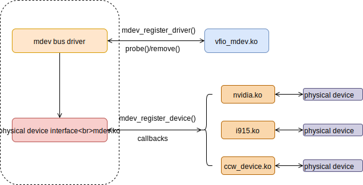
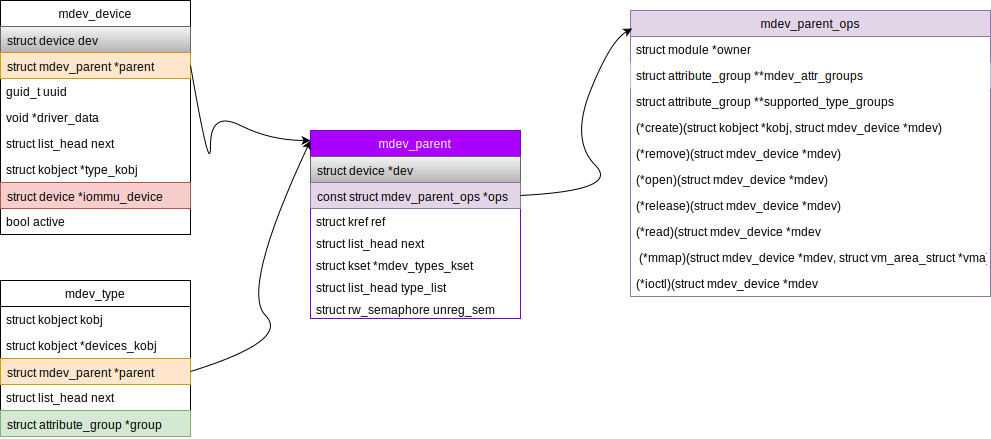

Title: VFIO Mediated Devices Introduction
Date: 2019-10-31 23:00
Tags: vfio mdev
Slug: vfio-mdev
Authors: Yori Fang
Summary: VFIO mdev Framework
Status: published

## 0. VFIO Mdev Introduction

VFIO框架解决了设备直通的问题，使得用户态可以直接使用设备的DMA能力。
VFIO使用IOMMU页表来对设备访问进行保护，将用户态对设备的访问限定在一个安全的域内。
利用这个框架，我们可以将GPU、网卡适配器、一些计算加速器（例如：AI芯片，FPGA加速器）直接呈现给虚拟机。

VFIO直通的缺点是单个PCIe设备只能直通给一台虚拟机,这样设备的利用率较低.
为了能够提升设备资源的利用率就出现了SRIOV（Single Root I/O Virtualization）技术。
SRIOV技术就像孙悟空一样，从本体是上拔出一根猴毛一吹，生成了多个分身，每个分身都有独自的战斗力。
SRIOV技术将设备的本体称为PF（Physical Function），可以从PF上生成多个VF（Virtual Function）,
多个VF之间使用PCIe ACS(Access Control Services)进行隔离，确保互相之间不会访问到对方的数据以确保安全。

那么对于一些不具备SR_IOV能力的设备，如何来做到同时向多个用户态进程提供服务呢？
Nvidia提出了基于VFIO的[VFIO Mdev框架](https://www.kernel.org/doc/Documentation/vfio-mediated-device.txt)来解决这个问题。
**在mdev模型的核心在于mdev会对硬件设备的状态进行抽象，将硬件设备的“状态”保存在mdev device数据结构中，
设备驱动层面要求实现一个调度器，将多个mdev设备在硬件设备上进行调度（分时复用），
从而实现把一个物理硬件设备分享给多个虚拟机实例进行使用。**

## 1. VFIO mdev框架Overview

下图是vfio mdev框架的示意图，这个框架对外提供了一组管理接口，其中包括：

* 创建和销毁一个mdev
* 从mdev bus driver上添加和删除一个mdev设备
* 从IOMMU group上增加和删除一个mdev设备



从框架来看Top Level是mdev bus driver，是为mdev虚拟的总线类型驱动，
这里我们可以绑定到vfio上，于是就有了vfio mdev，不过目前好像就只设计了vfio mdev。
可以通过调用`mdev_register_driver`向mdev bus添加`vfio_device_ops`的驱动。
下面的一层是和物理设备相关的接口，可以调用`mdev_register_device`来注册某一个物理设备到mdev上，
`mdev_register_device`传入了`mdev_parent_ops`参数，
`mdev_parent_ops`是跟物理设备相关的驱动集合，例如它可以是nvidia的GPU设备驱动(nvidia.ko)的callback，
可以是Intel集成显卡(i915.ko)的callback，还可以是s390设备驱动(ccw_device.ko)的callback。

mdev在vfio的基础上通过增加一个mdev bus，然后在这个bus下挂载mdev设备，
通过mdev的抽象，将和物理设备相关的驱动实现细节做了剥离，不同的厂商利用mdev框架去
实现自家设备的vendor driver hook（可以是开源的，可以是闭源的）。
Nvidia就是利用这个mdev框架去设计了Nvidia vGPU设备驱动，将自己的驱动实现细节做了闭源，这是Nvidia常用的套路。

## 2. VFIO mdev框架代码分析

从代码框架来看，vfio mdev首先提供了2个关键的注册接口，`mdev_register_driver`和`mdev_register_device`。

**先看mdev bus driver**，它提供了一个`mdev_register_driver`接口api来注册一个新的mdev driver，
在`vfio_mdev_init`的时候注册了`mdev_driver`类型的`vfio_mdev_driver`。

```c
struct bus_type mdev_bus_type = {
        .name           = "mdev",
        .probe          = mdev_probe,     //设备加载
        .remove         = mdev_remove,    //设备卸载
};
EXPORT_SYMBOL_GPL(mdev_bus_type);

(mdev.ko) mdev_init -> mdev_bus_register -> bus_register(&mdev_bus_type);  //将mdev_bus注册到系统上

struct mdev_driver {
        const char *name;
        int  (*probe)(struct device *dev);
        void (*remove)(struct device *dev);
        struct device_driver driver;          //定义结构体的时候，加上struct device_driver driver就表示driver类似
};

int mdev_register_driver(struct mdev_driver *drv, struct module *owner)
{
        /* initialize common driver fields */
        drv->driver.name = drv->name;
        drv->driver.bus = &mdev_bus_type;    //driver的bus指定为mdev_bus
        drv->driver.owner = owner;

        /* register with core */
        return driver_register(&drv->driver); //注册设备驱动
}
EXPORT_SYMBOL(mdev_register_driver);

static struct mdev_driver vfio_mdev_driver = {
        .name   = "vfio_mdev",
        .probe  = vfio_mdev_probe,
        .remove = vfio_mdev_remove,
};

static int __init vfio_mdev_init(void)
{
        return mdev_register_driver(&vfio_mdev_driver, THIS_MODULE);
}
```

当mdev设备在加载的时候，mdev bus driver负责将设备绑定到指定的iommu group上，具体流程是：

mdev create -> mdev_probe -> mdev_attach_iommu, drv->probe(dev) -> vfio_mdev_probe -> vfio_add_group_dev

`mdev_probe`的时候会创建一个iommu group，然后将设备添加到这个iommu group，
再调用`vfio_mdev_probe`将设备添加到一个vfio group当中。

**再看下mdev device driver**，这里提供了`mdev_register_device` api来注册一个新的物理设备驱动（Physical Device Driver Interface），注意这儿有个概念叫做`parent_device`，其实指的就是一个特定的物理设备，而mdev device则是物理设备的一个“实例”。

```c
struct mdev_parent_ops {
        struct module   *owner;
        const struct attribute_group **dev_attr_groups;
        const struct attribute_group **mdev_attr_groups;
        struct attribute_group **supported_type_groups;

        int     (*create)(struct kobject *kobj, struct mdev_device *mdev);
        int     (*remove)(struct mdev_device *mdev);
        int     (*open)(struct mdev_device *mdev);
        void    (*release)(struct mdev_device *mdev);
        ssize_t (*read)(struct mdev_device *mdev, char __user *buf,
                        size_t count, loff_t *ppos);
        ssize_t (*write)(struct mdev_device *mdev, const char __user *buf,
                        size_t count, loff_t *ppos);
        long    (*ioctl)(struct mdev_device *mdev, unsigned int cmd,
                        unsigned long arg);
        int     (*mmap)(struct mdev_device *mdev, struct vm_area_struct *vma);
};
```

`mdev_register_device`所做的事情是创建一个`parent device`并对其进行初始化
(很奇怪，取名为`mdev_register_parent_device`似乎更合适啊）。
`mdev` `parent`设备创建的时候，会在sysfs路径`/sys/class/mdev_bus/`下面创建一堆目录结构，
用户态通过sysfs接口可以完成mdev设备创建，删除，查询等操作。

```c
/*
 * mdev_register_device : Register a device
 * @dev: device structure representing parent device.
 * @ops: Parent device operation structure to be registered.
 *
 * Add device to list of registered parent devices.
 * Returns a negative value on error, otherwise 0.
 */
int mdev_register_device(struct device *dev, const struct mdev_parent_ops *ops)
{
        struct mdev_parent *parent;
        // 创建 mdev_parent设备
        parent = kzalloc(sizeof(*parent), GFP_KERNEL);
        // 初始化mdev parent设备
        kref_init(&parent->ref);
        init_rwsem(&parent->unreg_sem);

        parent->dev = dev;
        parent->ops = ops;      // 给mdev_parent_ops赋值
        
        // 创建sysfs接口
        ret = parent_create_sysfs_files(parent);
} 

struct mdev_parent_ops {
        struct module   *owner;
        const struct attribute_group **dev_attr_groups;
        const struct attribute_group **mdev_attr_groups;
        struct attribute_group **supported_type_groups;

        int     (*create)(struct kobject *kobj, struct mdev_device *mdev);
        int     (*remove)(struct mdev_device *mdev);
        int     (*open)(struct mdev_device *mdev);
        void    (*release)(struct mdev_device *mdev);
        ssize_t (*read)(struct mdev_device *mdev, char __user *buf,
                        size_t count, loff_t *ppos);
        ssize_t (*write)(struct mdev_device *mdev, const char __user *buf,
                        size_t count, loff_t *ppos);
        long    (*ioctl)(struct mdev_device *mdev, unsigned int cmd,
                        unsigned long arg);
        int     (*mmap)(struct mdev_device *mdev, struct vm_area_struct *vma);
};
```

`mdev_parent_ops`定义了一些属性，这些属性给QEMU/Libvirt等管理接口提供了一些查询和配置单个mdev设备实例的接口，
例如：`dev_attr_groups`,`mdev_attr_groups`和`supported_config`等。

* dev_attr_groups: attributes of the parent device
* mdev_attr_groups: attributes of the mediated device
* supported_config: attributes to define supported configuration



Nvidia vGPU方案中使用mdev框架对GPU进行分时复用，可以将一个GPU实例化成多个mdev vGPU设备，
然后将不同的vGPU直通给不同的虚拟机，提升了GPU的使用效率，降低了GPU实例的成本。
同时，mdev的作者为mdev框架提供了一些示例程序，阅读一个示例程序对我们理解mdev的工作原理有一定的帮助。

## 3. mdev based hardware virtio offloading

[https://patchwork.freedesktop.org/series/66987/](https://patchwork.freedesktop.org/series/66987/)

这个是最近Jason Wang在搞的一个东东，目的是为了搞一个vDPA的技术方案，
这个方案还是有点意思。我们知道virtio半虚拟化通过前后端内存共享的方式，减少了IO过程中的数据拷贝流程，
提升了模拟设备的性能。vDPA的核心思想是Qemu模拟vDPA设备的控制面，**将设备的数据面直接卸载到硬件上**，
因为我们可以直接将virtio virtqueue里面的io请求地址提供给硬件，让硬件直接通过DMA从virtqueue里面做IO请求，是不是很赞？
这个vDPA方案要求硬件支持virtqueue作为数据面，目前只有少量新硬件支持。

## 4. Refs

1. [VGPU ON KVM VFIO BASED MEDIATED DEVICE FRAMEWORK](https://www.linux-kvm.org/images/5/59/02x03-Neo_Jia_and_Kirti_Wankhede-vGPU_on_KVM-A_VFIO_based_Framework.pdf)
1. [Virtual Function I/O (VFIO) Mediated device](https://www.kernel.org/doc/Documentation/vfio-mediated-device.txt)
1. [Mediated Device For Ethernet](https://www.dpdk.org/wp-content/uploads/sites/35/2018/06/Mediated-Devices-Better-Userland-IO.pdf)
1. [持续助力数据中心虚拟化：KVM里的虚拟GPU](http://on-demand.gputechconf.com/gtc-cn/2018/pdf/CH8903.pdf)
1. [Add migration support for VFIO device](https://patchwork.kernel.org/cover/10820805/)
